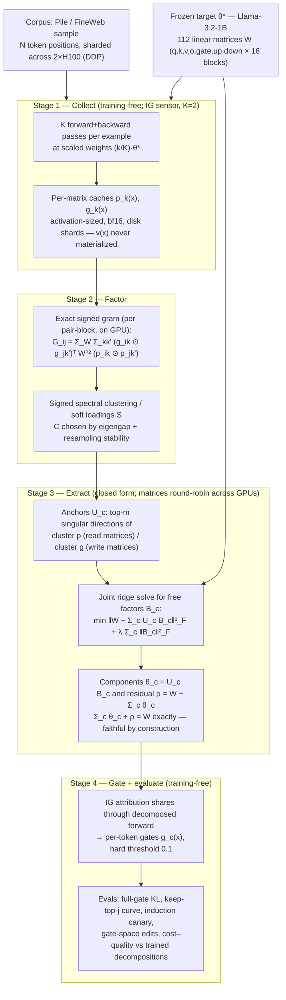

# Training-Free Parameter Decomposition from Attribution Geometry

**Working name:** geo-attribution (folder name only; no coined method name yet — pick one at write-up time)
**Status:** proposal, 2026-08-01
**Author context:** successor project to the attribution-gated APD variant in `/workspace/param-decomp/nano_apd/` (geometry-matched training, `polar.py` / `polar_lm.py`), building on the split-and-test v2 result (`split_v2.py`).

---

## 0. One-paragraph summary

Every method in the linear parameter decomposition family (APD, SPD, VPD, and our geometry-matched variant) *trains* a decomposition of the weights against faithfulness and sparsity/importance losses, at a cost that grows prohibitive with model size. This proposal inverts the paradigm: the mechanisms are **read off** the geometry of the model's own per-example parameter attributions, using only forward+backward passes and closed-form linear algebra — no decomposition training at all. The central claim is that the expensive optimization in the APD family is largely *recovering structure that is already present in cheap first-order gradient statistics*, and that we can extract that structure directly: cluster/factor the (signed, un-averaged) example × parameter attribution matrix, then solve in closed form for low-rank weight components — one per factor — that **sum exactly to the original weights** together with an explicit residual. We already hold a seed result: on our toy benchmark of cross-layer distributed representations, this pipeline (recursive 2-means on attribution vectors + signed rank-1 ridge extraction) achieves keep-only sufficiency 0.087, *better* than our trained rank-1 method (0.10–0.12), training-free. The open gap is separation (0.45 vs 0.9) and residual mass; closing it — and demonstrating the cost–quality frontier at LM scale against trained decompositions — is the project.

---

## 1. Background and motivation

### 1.1 The cost problem in linear parameter decomposition

APD [Braun et al., 2501.14926], SPD [Bushnaq et al., 2506.20790], VPD ("Interpreting Language Model Parameters"), and our own geometry-matched variant all share a contract: decompose the weights $\theta^*$ of a trained network into components

$$
\theta^* \;=\; \sum_{c=1}^{C} \theta_c \;(+\; \rho),
$$

such that (i) the sum is faithful, (ii) few components are needed on any one input (minimality), and (iii) each component is simpler than the whole (low rank / low description length). All of them obtain the $\theta_c$ by **gradient-descent training** with multi-term objectives. Concretely from our own runs: the 67M-parameter pile-4L target cost ~16–30 H100-hours per decomposition run at C=2048, with brittle loss balancing (the faith-weight mis-scaling incident: a component sum *worse than all-zeros* passed every relative metric), schedule and precision pathologies (bf16/TF32 floors), and multi-seed requirements. Cost and fragility both scale against us.

### 1.2 What the previous project actually discovered

Three findings from the nano_apd project motivate the inversion:

**(a) The target's own attribution geometry contains the mechanism boundaries.** The single ingredient that made our trained variant hit ground truth (separation 0.92→1.00, keep-only 0.028→0.007 on the benchmark) was the *usage-geometry loss*: matching the cosine structure of component attributions to the cosine structure of the target model's per-parameter attribution vectors $v(x) = \nabla_\theta \mathcal{L}(x) \odot \theta$. Top-k selection, minimality penalties, and certified-faithfulness selection all failed to create specialization pressure; the target's attribution gram succeeded. If the supervision signal that makes *training* work is a fixed statistic of the target model, the natural question is whether we need the training at all.

**(b) Training-free extraction already works partially (split-and-test v2).** Recursive 2-means clustering of $v(x)$ over a batch of inputs, followed by per-cluster signed rank-1 extraction with ridge-regularized least squares and an explicit residual, achieved — with zero training —

| metric (TMDR benchmark) | split_v2 (training-free) | our trained rank-1 | trained geometry-matched (best) |
|---|---|---|---|
| keep-only (sufficiency, ↓) | **0.087** | 0.10–0.12 | 0.006–0.016 |
| separation (↑) | 0.45 | 0.89–0.92 | 0.97–1.00 |
| cross-layer | 1.0 | — | 0.79–0.84 (functional) |
| cost | seconds | ~101 s / 400 steps × 16k+ | ~75 s / 400 steps × 16k |

Two controls passed: the residual alone is inert (keep-only 0.604 ≈ passthrough baseline), and signedness is essential (soft nonnegative shares degrade keep-only to 0.61 — cancellation between pieces is real structure, not noise).

**(c) The attribution sensor determines what is recoverable.** First-order grad×activation attribution is nearly blind to QK/softmax-mediated computation (induction's upstream heads invisible at any granularity), and multi-$\alpha$ integrated-gradient credit (IG over the component gate path, $K{=}2$ sufficing) measurably fixed induction smearing in the trained setting. Any training-free method inherits the sensor's blind spots — so sensor choice is a first-class design axis here, not a detail.

### 1.3 Why this is the right next project

- **Novelty of kind, not degree:** every neighbor either trains a decomposition, averages attributions into a single task-defined importance score, or stops at data-side clusters (§5). Training-free extraction of a *weight-faithful* decomposition is an unoccupied cell.
- **Cost:** the whole pipeline is embarrassingly parallel forward+backward passes plus linear algebra. The 67M target that costs ~16–30 H100-hours to decompose by training needs minutes of gradient collection.
- **Continuity:** it reuses the project's validated assets — the $v(x)$ object, the signed rank-1 extraction, the exact pairwise-gram identity from `polar_lm.py`, the IG-credit option, and the entire evaluation battery including the functional-check referee that caught two counterfeit decompositions.

---

## 2. The central object

### 2.1 Per-example parameter attribution

For input $x$ and scalar objective $\ell(x)$ (toys: $\tfrac12\|y(x)\|^2$; LMs: summed CE over non-final positions — recall the final-position gotcha: CE has no label there and attribution is identically zero), define the **parameter attribution vector** at the trained weights $\theta^*$:

$$
v(x) \;=\; \nabla_{\theta}\,\ell(x)\big|_{\theta^*} \,\odot\, \theta^* \;\in\; \mathbb{R}^{P}.
$$

This is first-order Taylor credit for full ablation of each coordinate — "which parameters did this input use, with what sign and magnitude." Stacking over a corpus $\{x_1,\dots,x_N\}$ gives the **attribution matrix**

$$
V \;=\; \begin{bmatrix} v(x_1)^\top \\ \vdots \\ v(x_N)^\top \end{bmatrix} \in \mathbb{R}^{N \times P}.
$$

The proposal, in one sentence: **mechanisms are the (signed) factors of $V$, and the decomposition of $\theta^*$ is obtained by projecting $\theta^*$ onto those factors.**

Aggregation granularity is a design axis for LMs: per-token $v$ (fine, huge $N$, matches our per-token gates), per-sequence sums (coarse), or per-(token, contrast) — see §2.3 (A2).

### 2.2 The exact pairwise-gram identity (no sketching needed for geometry)

$V$ is never materialized. For a linear layer with weight $W \in \mathbb{R}^{d_{out} \times d_{in}}$, input activation $p(x)$ and output cotangent $g(x) = \partial \ell / \partial (Wp)$, the per-matrix attribution is the rank-1-masked matrix $v_W(x) = \big(g(x)\,p(x)^\top\big) \odot W$, and inner products factor exactly:

$$
\big\langle v_W(x_i),\, v_W(x_j) \big\rangle
\;=\; \big(g_i \odot g_j\big)^{\!\top} \, W^{\odot 2} \, \big(p_i \odot p_j\big).
$$

So the full $N \times N$ attribution gram $G = \sum_{\text{matrices}} \langle v_i, v_j\rangle$ is computable exactly from cached activations/cotangents (activation-sized storage, one forward+backward per example, one matmul per pair-block per matrix). This identity is already implemented and validated at Pythia-14M scale in `polar_lm.py` (used there as the geometry loss); here it graduates from loss ingredient to the primary computational object. Multi-token positions sum over the position axis inside $p, g$ caches. For very large $N$, Nyström/landmark or TRAK-style random projection sketches of $v(x)$ are the fallback — but the exact identity means small LMs need no approximation at all.

The role of this identity is purely computational feasibility — it is what makes the geometry exact and cheap at LM scale; nothing in the method depends on it conceptually. It composes with the IG sensor (§2.3): each example then carries $K$ cached $(p_k, g_k)$ pairs from the scaled-weight forwards, $v_W(x) = \big(\tfrac1K\sum_k g_k p_k^\top\big) \odot W$, and the inner product expands exactly into $K^2$ cross terms of the same form — extra cost, zero approximation.

### 2.3 Sensor variants (design axis)

- **A1 — IG-K (DEFAULT, decision 2026-08-01):** $v(x) = \theta^* \odot \frac{1}{K}\sum_{k=1}^{K} \nabla_\theta\,\ell(x)\big|_{(k/K)\,\theta^*}$ — Aumann–Shapley credit along the shared weight-scaling path, $K \in \{2,3\}$, $K{=}2$ the working default. Evidence: this is the variant that fixed induction smearing in the trained setting; at 67M, $K{=}2$ *beat* $K{=}8$ on the causal ablation referee (low-$\alpha$ gradients carry the retrieval-relevant credit), so small $K$ is both cheaper and better. Cost: $K\times$ forward+backward passes, $K^2\times$ gram terms (§2.2).
- **A0 — plain:** $v(x) = \nabla\ell \odot \theta$ (what split_v2 and the geometry loss used). Retained as the cheap ablation row to quantify what IG buys at LM scale.
- **A2 — contrast-conditioned:** $v$ computed on counterfactual pairs (e.g., repeat-half vs first-half) for analysis-time sharpening; **not** used for unsupervised discovery (it reintroduces task supervision) but available for the supervised probes in evaluation.
- **A3 — Hessian-aware (stretch):** second-order correction on the QK path only, where A0 is provably weak. Only if A1 fails the induction canary at LM scale.

### Figure 1 — setup

Reading order: the target model is touched only twice — $K$ forward+backward passes per example (Stage 1) and as the fixed right-hand side $W$ of the ridge solve (Stage 3). Everything between is linear algebra on activation-sized caches; no optimization loop exists anywhere in the diagram.

---

## 3. Method: the extraction pipeline

Four stages, all training-free. Stage names are descriptive, not branding.

### Stage 1 — Collect

$K$ forward+backward passes per example at scaled weights $(k/K)\theta^*$ (IG sensor, $K{=}2$ default), with the corpus **sharded across both H100s via DDP** — collection is embarrassingly parallel, so both GPUs run at full batch throughout. Primary target: **Llama-3.2-1B** (16 blocks × 7 linear matrices = 112 decomposed matrices; $\sum(d_{in}{+}d_{out}) \approx 40$k dims/block). Token positions subsampled (16–64 per sequence, $N \approx 3\times10^4$–$10^5$ positions total); per-matrix $(p_k, g_k)$ caches in bf16 written as incremental disk shards (~1.3 MB/position/IG-point at 1B → tens of GB at target $N$; incremental shards per the checkpointing lesson, and mind the /workspace quota). bf16 is acceptable here — the precision-firewall lesson applies to *training*; Stage 3's ridge solve re-collects exact fp32 quantities for the selected clusters only.

### Stage 2 — Factor

Discover $C$ groups (and $C$ itself) from the gram $G$.

- **F0 (baseline, known-good):** recursive 2-means on $v(x)$ / on gram rows, as in `split_v2.py`. Found 133 leaves for 100 true mechanisms — granularity error (merges+splits) is the known failure mode and the main cause of the separation gap.
- **F1 (primary):** spectral clustering on the **signed** similarity $G$ (do *not* ReLU or take $|G|$; anticorrelated attribution is evidence of *shared, contested* parameters, and the training-loss lesson says the zero-cosine constraint between unrelated pairs is where separation pressure lives — center rows before cosine to avoid the all-merged degenerate direction). Model selection by eigengap + stability under corpus resampling, not a fixed $C$.
- **F2 (soft/overlapping):** signed sparse factorization $V \approx S M$ with sparse example loadings $S \in \mathbb{R}^{N\times C}$ and mechanism directions $M \in \mathbb{R}^{C\times P}$ (semi-NMF-style alternating least squares on the sketched/implicit $V$; loadings signed). Motivation: real inputs use several mechanisms at once (an LM token's ground truth is not 1-sparse — the 178-gate finding), and hard partitions of *examples* systematically merge co-occurring mechanisms. F2 is the hypothesized fix for the separation gap.
- **F3 (ablation, mid-cost):** a small SAE trained *on sketched attribution vectors* (not on the model weights — minutes, not hours). This is a controlled interpolation point between training-free (F0–F2) and trained decomposition, to quantify what optimization buys.

### Stage 3 — Extract weight components (closed form)

For each factor $c$ and each weight matrix $W^{(l)}$, the cluster-restricted attribution mass is a sum of masked rank-1 terms $\sum_{x \in S_c} s_c(x)\, (g(x) p(x)^\top) \odot W^{(l)}$, so the natural component is low-rank. Following the validated split_v2 recipe, generalized to rank $m$:

1. **Anchor** on the well-conditioned (embedding-space) side: take the top-$m$ left/right singular directions of the cluster's stacked outer products — input directions $\{p(x)\}_{S_c}$ for read matrices, cotangent directions $\{g(x)\}_{S_c}$ for write matrices. (The narrow neuron side is overcomplete; anchoring there explodes with cancelling coefficients — established empirically.)
2. **Joint ridge solve** for the free factors of all components simultaneously:

$$
\{B_c^{(l)}\} \;=\; \arg\min_{\{B_c\}} \Big\| W^{(l)} - \sum_{c} U_c^{(l)} B_c^{(l)} \Big\|_F^2
\;+\; \lambda \sum_c \big\|B_c^{(l)}\big\|_F^2,
\qquad \lambda \sim 10^{-3},
$$

   a single linear system per matrix ($\lambda$ handles the near-collinearity that plain least squares cannot; established empirically). Optionally weight the Frobenius norm by per-entry attribution mass so components claim the weight mass they actually use.
3. **Residual:** $\rho^{(l)} = W^{(l)} - \sum_c U_c^{(l)} B_c^{(l)}$, kept as one explicit always-on component. **Faithfulness is exact by construction** — the defining advantage over both L3D (no weight relation at all) and trained methods (faithfulness is a loss to be balanced, cf. the pile-4L mis-scaling incident). Residual acceptance requires the inertness control: residual-alone keep-only must sit at the passthrough baseline.

### Stage 4 — Gate (evaluation-time, also training-free)

Per-input component activity from attribution shares through the decomposed forward: $A_c(x)$ = squared IG/gradient credit of component $c$; gates $g_c(x) = \big(A_c(x)/\max_{c'} A_{c'}(x)\big)^{\tau}$ or hard threshold at 0.1 (the threshold gate won the toy arms). Gates feed the standard eval battery and gate-space editing. No mask network, no learned gates — consistent with the project's criteria.

### Known iteration levers for the separation gap (0.45 → target ≥0.8)

1. F2 soft loadings (co-occurrence merging is the suspected dominant error);
2. rank-$m$ extraction with $m$ from the cluster's singular spectrum (participation-ratio criterion — reuse the batchAverageRank machinery) instead of fixed rank-1;
3. IG-K sensor for mechanisms invisible to A0;
4. attribution-mass-weighted extraction (reduce residual mass, currently 22–56% of weight norm);
5. two-round refinement: re-cluster with gates from round 1 as features (still training-free — one extra collect pass).

---

## 4. Evaluation plan

Ordering decision (Rohan, 2026-08-01): **LM-first — toys deferred.** Time pressure dominates; the toy ladder moves to an appendix role, run only if an LM-scale result needs a ground-truth diagnosis.

### 4.1 LM scale (primary)

- **Llama-3.2-1B (headline target):** no trained decomposition exists at this scale — that absence *is* the claim (nobody can afford one; we don't need one). Evaluation is therefore referee-based against the model itself: full-gate KL/token and keep-top-$j$ KL curve (behavior preservation under gating), gate L0, induction canary (contrast spectrum + top-$k$ ablation with random-set null, ported from `induction_canary.py` — probe at position −2, never the final token), gate-space erasure edit (language-erasure analog of the German edit: zero top-$k$ contrast components for a held-out language, measure on-target vs off-target ΔCE with random controls), and auto-interp on the top ~100 owners via the established API labeling pipeline (org key, direct API, not subagents).
- **pile-4L 67M (the cost–quality comparison row):** the one scale where trained baselines sit on disk — our sum-norm artifact (369 owners, canary-positive) and the VPD checkpoint. Same pipeline, direct metric-for-metric comparison; this is where H4's numbers come from. Cheap to add since nothing trains.
- **Pythia-14M:** bridge only — used if 1B surfaces a failure that needs a fast small-model reproduction against the v3/v5 artifacts.
- **Sparsity honesty:** report gates > 0.01 per token; the trained runs sit at ~178–292 — matching behavior at similar or better concentration is a win; markedly worse concentration is reported, not hidden.

### 4.2 The averaging strawman (novelty made empirical, LM version)

Implement the Family-A skeleton at 1B: average $|v(x)|$ over a task slice (e.g., the erasure language), threshold into a parameter mask, evaluate as a "mechanism" with the same referees (ΔCE on-target/off-target, ablation curves). Prediction: the averaged mask is either broad (large off-target damage) or shallow (weak on-target effect), while factored components achieve the German-edit profile (on-target kill, off-target null). The toy version of this experiment (where failure is provable by construction, 100 features through 25 neurons/layer) moves to the deferred appendix.

### 4.3 Hypotheses (pre-registered)

- **H1 (deferred with toys):** ≥80% of the trained frontier's keep-only and ≥0.8 separation on the TMDR benchmark, training-free. (Currently: keep-only already exceeded; separation 0.45.)
- **H2:** signedness necessary — unsigned/ReLU'd variants of F1/F2 collapse (already shown for shares; replicate for factorization, at 1B via the referee metrics).
- **H3:** A1 (IG-K2) recovers induction-adjacent components at 1B/67M where A0 does not (canary: peaked contrast spectrum + top-2 ablation effect with random control null).
- **H4:** cost–quality frontier: at 67M, ≥50% of trained separation-analog metrics at ≤1% of the H100-hours; at 1B, referee-passing decomposition at single-digit H100-hours total. (Conservative on quality, aggressive on cost — the honest headline.)
- **H5:** soft loadings (F2) beat hard partitions (F0/F1) on keep-top-$j$ and edit specificity (tests the co-occurrence merging diagnosis at LM scale, where tokens are genuinely many-mechanism — the 178-gate finding).

### 4.4 Scope honesty (inherited limitations, stated up front)

- **Participation vs ownership:** nothing here adds ownership pressure; the decomposition will inherit the participation bias of the whole family. Gate-space edits are in scope; *weight-space* edit permanence (VPD's ablation-robustness property) is explicitly out of scope — no mask-sampling training exists to provide it. One paragraph, one experiment (random-subset subtraction check), honest reporting.
- **Sensor blindness:** A0's QK-blindness is inherited by construction; A1 is the mitigation and H3 the test. If H3 fails, the paper reports the boundary honestly: training-free extraction covers direct-path mechanisms; interaction-mediated mechanisms need better sensors (this is itself a finding).
- **Local validity:** $v(x)$ is first-order credit at $\theta^*$; mechanisms whose removal is only visible non-locally (saturation) are under-credited — same caveat L3D states.

---

## 5. Related work and explicit novelty

### 5.1 The three families

**A — Averaged attribution over a fixed ontology.** ADAG [2604.07615]: per-prompt grad×activation input-attribution and output-contribution vectors per MLP neuron, *uniformly averaged across contexts*, ReLU'd, spectral-clustered → labeled neuron partitions. Knowledge neurons [Dai et al.], EAP/EAP-IG corpus-averaged circuits, Fisher/SNIP masks, subnetwork probing, WAGLE [2410.17509] (bi-level weight attribution for unlearning). Shared structure: *attribution(unit, $x$) averaged over a chosen task slice, thresholded — the average is the mechanism.* Consequences: supervised by the slice (cannot enumerate unqueried mechanisms); averaging is a rank-1 statistic of $V$ that destroys the covariation separating superposed mechanisms; units are architecture-fixed and importance is scalar, so sub-neuron signed structure is inexpressible.

**B — Un-averaged per-example gradients, unsupervised.** QDG [2303.13506]: spectral clustering of normalized per-sample gradient cosines → clusters of **examples** (skills). Validates the premise; never produces a parameter-space object, faithfulness contract, or edit. GradientSpace, TRAK: same object, different questions (data curation / data attribution); they contribute scaling machinery, not decompositions.

**C — Trained parameter decompositions.** APD/SPD/VPD/tPD [2607.13047]: the contract we keep, at training cost we drop. **L3D [2504.00194] — closest neighbor:** decomposes per-sample gradients $\nabla_W D(f(x), y_{ref})$ into low-rank parameter directions — but (i) *trains* the dictionary (learned transforms + topK, an SAE-on-gradients), (ii) objective is gradient reconstruction with **no weight-faithfulness** (components need not relate to $W$; weight-space ablation evals don't type-check; 19–40% recon error), (iii) toy scale + single blocks, no APD/SPD comparison.

### 5.2 The novelty grid

| capability | ADAG / avg-attr masks | QDG | L3D | APD/SPD/VPD/tPD | **this proposal** |
|---|---|---|---|---|---|
| unsupervised (no task slice) | ✗ | ✓ | ✓ | ✓ | ✓ |
| un-averaged per-example structure | ✗ | ✓ | ✓ | partial | ✓ |
| training-free | ✓ | ✓ | ✗ | ✗ | ✓ |
| parameter-space output | ✗ | ✗ | ✓ | ✓ | ✓ |
| components sum to $W$ exactly | ✗ | ✗ | ✗ | ✓ (as a trained loss) | ✓ (by construction) |
| sub-neuron, signed | ✗ | ✓ (data-side only) | ✓ | ✓ | ✓ |

Three defensible novelty claims, one per family:

1. **vs A:** factor the attribution matrix *before* aggregation — mechanisms and example-assignments emerge jointly, unsupervised; the averaged importance vector is a rank-1 shadow of the object we factor. Demonstrated by the §4.2 strawman (LM version now primary; the by-construction toy version deferred to appendix).
2. **vs B (QDG):** close the loop from example clusters to *parameter* objects under a faithfulness contract with causal evaluation and editing. "QDG clusters the rows; we factor the matrix and keep the columns, summing to $W$."
3. **vs C (L3D, APD-family):** extraction, not optimization. Same contract as APD, zero decomposition training; unlike L3D, exact weight faithfulness so the entire trained-family eval suite and gate-space editing apply unchanged. Positioning vs APD/SPD/VPD is a cost–quality frontier, not a parity claim.

Anticipated objections, prepared answers:

- *"QDG + least squares?"* — The extraction stage is where the difficulty concentrated empirically: signed cancellation essential, overcomplete-side anchoring + ridge required (plain lstsq explodes), residual inertness must be certified, sensor choice changes what is recoverable at LM scale. None of this exists in QDG; L3D's 19–40% error shows assembly is not trivial.
- *"L3D already did gradient decomposition."* — Cite it as evidence the object matters; the head-to-head on shared toys (their outputs, our metrics) makes the faithfulness and training-free distinctions empirical.

---

## 6. Work plan

LM-first ordering (Rohan, 2026-08-01); toys demoted to a contingency/appendix phase.

| phase | content | compute | exit criterion |
|---|---|---|---|
| P1 (days 1–2) | Port Stage 1 to Llama-3.2-1B (HF weights, fp32 master / bf16 passes): DDP corpus sharding, IG-K2 caches as disk shards, block-parallel exact gram; sanity = eigenvalue spectrum + eigengap plot of $G$ | ~1–2 H100-hrs | gram computed at $N \geq 3{\times}10^4$; visible spectral structure or diagnosed |
| P2 (days 3–5) | Stage 2–3 at 1B: F1 signed spectral (+F0 baseline), anchored rank-$m$ ridge extraction (matrices round-robin over both GPUs), residual inertness control; Stage 4 gates; behavioral evals (full-gate KL, keep-top-$j$) | ~2–4 H100-hrs | faithful-by-construction decomposition with full-gate KL comparable to trained-run ballpark, or failure mode identified |
| P3 (week 2) | Referees at 1B: induction canary (H3, A1 vs A0 arm), language-erasure gate edit with random controls, averaging-strawman comparison (§4.2), auto-interp top ~100 owners | ~2 H100-hrs | canary + edit verdicts with nulls |
| P4 (week 2–3) | 67M pile-4L comparison row vs trained sum-norm artifact + VPD checkpoint; cost accounting (H4) | ~1–2 H100-hrs | metric-for-metric table |
| P5 (week 3) | Iteration levers as diagnosed: F2 soft loadings (H5), rank-$m$ from cluster spectra, mass-weighted extraction, two-round refinement; H2 signedness ablation | ~2–4 H100-hrs | best-effort frontier documented |
| P6 (week 3–4) | Write-up; scope-honesty experiment (weight-space subtraction check); deferred toy appendix + L3D head-to-head + H1 only if time permits | — | draft |

Compute discipline (standing rules): **both H100s in use at every phase** — DDP corpus sharding for collection, pair-block gram matmuls split across GPUs, per-matrix ridge solves round-robin; big batches. No multi-hour optimization runs exist in this plan, but collection sweeps still checkpoint incrementally (cache shards), and disk quota is checked before large cache writes (two prior quota incidents).

### Decision point (Rohan)

The headline framing: **(a)** cost–quality frontier ("X% of trained quality at ≤1% cost" — safe, useful, recommended) vs **(b)** parity ("training was never necessary" — only if P2 surprises us on separation). Default to (a); (b) remains a possible upgrade, not a premise.

---

## 7. Relation to the other proposed directions

- The **developmental study** (attribution geometry across training checkpoints) shares Stages 1–2 verbatim; if P1–P2 succeed, it becomes a cheap companion paper (Pythia checkpoint suite) rather than a separate build.
- The **targeted arc** (supervised few-component extraction, relearning attacks) is complementary, not competing: tPD [2607.13047] now occupies "targeted trained decomposition with residual," so that arc's load-bearing novelty is the relearning-robustness evaluation — independent of this proposal's fate.
- The **ownership objective** remains the natural sequel: if training-free extraction matches trained participation-quality, the *next* training budget should buy ownership (ablation-consistency), not faithfulness — this proposal sharpens that argument.

---

## References

- APD: Braun et al., *Interpretability in Parameter Space* — arXiv:2501.14926
- SPD: Bushnaq et al., *Stochastic Parameter Decomposition* — arXiv:2506.20790
- VPD: *Interpreting Language Model Parameters* (Goodfire) — see `papers/` in param-decomp
- tPD: *Targeted Recovery of Weight-Space Mechanisms* — arXiv:2607.13047
- L3D: *Identifying Sparsely Active Circuits Through Local Loss Landscape Decomposition* — arXiv:2504.00194
- QDG: Michaud et al., *The Quantization Model of Neural Scaling* — arXiv:2303.13506
- ADAG: *Automated Description of Attribution Graphs* — arXiv:2604.07615
- WAGLE: *Strategic Weight Attribution for Effective and Modular Unlearning* — arXiv:2410.17509
- TRAK: Park et al., *TRAK: Attributing Model Behavior at Scale* — gradientscience.org/trak
- Knowledge neurons: Dai et al., arXiv:2104.08696
- EAP-IG / MIB attribution benchmarking — per the July research syntheses in project notes
