# Conversation Transcript

Task: Explain parameter decomposition

> Exported from the Codex conversation. Tool calls and hidden reasoning are omitted; user and assistant messages are preserved in chronological order.

## User

In this repo, I've been working on a parameter decomposition method that doesn't require training. Explain the whole method piece by piece, with implementation details. 

This should suffice to explain to my mentor, who has not seen this method before.

## Assistant (progress update)

I’ll trace the method from its mathematical idea through the actual code paths, tests, and experiment entry points. I’m using the visualization skill because a compact architecture/flow view should make the explanation mentor-ready, then I’ll anchor every part to the repository’s implementation.

## Assistant

# Training-free parameter decomposition from attribution geometry

The method can be summarized in one sentence:

> Cluster token positions according to which parameters they use, then assign each weight entry to the cluster—or clusters—that use it most characteristically.

This produces cross-layer parameter components without gradient-descent training. The current implementation is more mature than the original proposal: the proposed low-rank extraction failed, and the working method now uses entry-wise ownership partitions or nonnegative fractional ownership.

The main implementation is [geo67.py](/workspace/circuit-decomp/geo-attribution/geo67.py:1), the experimental history and results are in [intermediate.md](/workspace/circuit-decomp/geo-attribution/intermediate.md:1), and the original rationale is in [proposal.md](/workspace/circuit-decomp/geo-attribution/proposal.md:1).

```mermaid
flowchart LR
    X["Token positions from a corpus"] --> S["IG or GIM attribution sensor"]
    M["Frozen language model"] --> S
    S --> C["Cache input activations p and output cotangents g"]
    C --> G["Exact attribution Gram matrix"]
    G --> F["Signed spectral embedding + spherical k-means"]
    F --> L["Position clusters"]
    L --> E["Measure each cluster's use of every weight entry"]
    E --> H["Hard ownership + shared base"]
    E --> P["Proportional fractional ownership"]
    P --> A["Gate-aware share solve"]
    H --> B["Cross-layer component bank"]
    P --> B
    A --> B
    B --> R["Attribution gates, behavioral tests, and weight edits"]
```



## 1. What is being decomposed?

For the 67M model, the method decomposes 24 attention and MLP matrices:

- `q`, `k`, `v`, and `o` projections;
- MLP input and output projections;
- across four transformer blocks.

Embeddings and normalization parameters are left untouched.

For every decomposed matrix \(W\), the output is a collection of components \(W_c\), optionally plus an always-on base \(W_0\), satisfying

\[
W = W_0 + \sum_{c=1}^{C} W_c.
\]

The same cluster index \(c\) is used across every layer and matrix. Thus, “component 267” is not one neuron or one matrix fragment: it is a set of associated weight slices spanning the whole model.

The central difference from APD-, SPD-, or VPD-style methods is how the components are obtained:

- trained decompositions learn them by optimizing reconstruction, sparsity, and simplicity losses;
- this method measures the frozen model, clusters those measurements, and constructs components algebraically.

There is still substantial computation—backward passes, eigensolvers, k-means, and linear solves—but no optimizer updates the model or decomposition parameters.

## 2. The fundamental measurement: parameter attribution

Consider one linear module at token position \(t\):

\[
y_t = Wp_t,
\]

where \(p_t\) is its input activation. Let

\[
g_t = \frac{\partial \mathcal L}{\partial y_t}
\]

be the cotangent arriving at the module output.

The gradient of the loss with respect to \(W\) is the outer product

\[
\nabla_W \mathcal L = g_t p_t^\top.
\]

The method uses gradient-times-weight attribution:

\[
v_W(t) = W \odot \left(g_t p_t^\top\right).
\]

Intuitively, \(v_W(t)\) asks:

> Which entries of \(W\) were locally important for the computation passing through this position, including the sign of their contribution?

Concatenating this object over all decomposed matrices would produce a huge attribution vector \(v(t)\) for each token position. Stacking positions would produce an attribution matrix

\[
V \in \mathbb R^{N\times P},
\]

where \(N\) is the number of sampled positions and \(P\) the number of decomposed parameters.

The method’s hypothesis is that mechanism structure appears as recurring directions among the rows of \(V\).

### The actual loss

The implementation uses summed next-token cross-entropy:

\[
\mathcal L =
\sum_{b,t<T-1}
\operatorname{CE}\left(\text{logits}_{b,t}, x_{b,t+1}\right).
\]

The final position is excluded because it has no next-token label. See [ce_sum](/workspace/circuit-decomp/geo-attribution/geo67.py:167).

During collection, 16 positions are normally sampled from each 512-token sequence. The first four and final two positions are excluded to avoid boundary effects and very small cotangents. See [stage_collect](/workspace/circuit-decomp/geo-attribution/geo67.py:174).

## 3. Integrated-gradient sensing

Plain gradient-times-weight attribution can miss saturated or interaction-mediated computation. The default sensor therefore approximates an integrated gradient along a path that scales all decomposed matrices from zero to their trained values.

For \(K\) integration points,

\[
\bar v_W(t)
=
W\odot
\frac{1}{K}
\sum_{k=1}^{K}
g_{t,k}p_{t,k}^{\top},
\qquad
\alpha_k = \frac{k}{K}.
\]

The default is \(K=2\), so the model is evaluated with decomposed weights scaled by \(0.5\) and \(1.0\). Importantly:

- only the designated linear matrices are scaled;
- embeddings, norms, and other parameters are not on the path;
- parameters require gradients only so activation cotangents can be computed;
- no optimizer or `backward()` update occurs.

The `Capture` wrapper performs weight scaling and stores each module’s input and output tensors in [geo67.py](/workspace/circuit-decomp/geo-attribution/geo67.py:140). Collection calls `torch.autograd.grad` on module outputs to obtain \(g\) directly.

The caches contain, for every module,

\[
p,g \in \mathbb R^{K\times N\times d},
\]

stored in bfloat16 on CPU. Current and next token IDs are stored too, which later supports zero-cost purity analysis and automatic interpretation.

### Optional GIM sensor

The repository also tests a modified backward rule called GIM. Its forward pass is intended to remain unchanged, but it:

- replaces the attention softmax Jacobian with one computed from a temperature-softened distribution;
- detaches RMSNorm’s normalization statistic;
- forces manual attention so the softmax backward can be intercepted.

This sends more attribution credit into saturated QK paths. It is implemented in [apply_gim](/workspace/circuit-decomp/geo-attribution/geo67.py:107).

GIM improved gated induction copy accuracy in a matched experiment from approximately \(0.114\) to \(0.188\), but it did not yield cleanly ablatable induction components. Thus it helps the sensor, but does not solve the ownership problem.

## 4. Building the attribution geometry without materializing \(V\)

Materializing \(V\) is infeasible: even the 67M model would require a position-by-tens-of-millions matrix.

Instead, the code computes only its Gram matrix:

\[
G = VV^\top,
\qquad
G_{ij} = \langle v(i),v(j)\rangle.
\]

For one weight matrix,

\[
\left\langle v_W(i),v_W(j)\right\rangle
=
(g_i\odot g_j)^\top
W^{\odot 2}
(p_i\odot p_j).
\]

With integrated gradients, this becomes a sum over all \(K^2\) pairs of integration points:

\[
G_{ij}^{(W)}
=
\frac{1}{K^2}
\sum_{a,b}
(g_{i,a}\odot g_{j,b})^\top
W^{\odot 2}
(p_{i,a}\odot p_{j,b}).
\]

Finally, these values are summed over all decomposed matrices.

This identity is algebraically exact; the implementation uses bfloat16 caches and intermediates with a float32 accumulator, so its numerical realization has normal low-precision error.

The code is in [stage_gram](/workspace/circuit-decomp/geo-attribution/geo67.py:252). Important implementation choices are:

- the \(N\times N\) matrix is processed in pair blocks, normally \(256\times256\);
- modules are divided between GPUs;
- every rank accumulates a full partial Gram matrix;
- the partial matrices are summed with `dist.all_reduce`;
- the cost is quadratic in \(N\).

At \(N=65{,}536\), the Gram stage takes roughly 50 minutes in the recorded two-H100 run. It is the only strongly superlinear part of the pipeline.

## 5. Turning the Gram matrix into position clusters

The raw Gram matrix is first double-centered:

\[
G_c = HGH,
\qquad
H=I-\frac{1}{N}\mathbf 1\mathbf 1^\top.
\]

This removes the global mean attribution direction. It is then normalized by its centered diagonal:

\[
\widehat G_{ij}
=
\frac{(G_c)_{ij}}
{\sqrt{(G_c)_{ii}(G_c)_{jj}}}.
\]

That makes it analogous to a signed cosine-similarity matrix. Negative similarities are retained; the code does not apply a ReLU or absolute value here. See [normalize_gram](/workspace/circuit-decomp/geo-attribution/geo67.py:295).

Next, the top eigenpairs are computed. For large \(N\), dense `torch.linalg.eigh` was unreliable because of cuSOLVER workspace failures, so the implementation uses:

1. a random \(N\times k\) subspace;
2. eight power/subspace iterations;
3. QR orthogonalization;
4. a small Rayleigh–Ritz eigendecomposition.

The spectral embedding is

\[
Y = U_C\Lambda_C^{1/2}.
\]

Its rows are normalized and clustered with spherical k-means using cosine similarity, k-means++-style initialization, 100 iterations, and three restarts. See [stage_factor](/workspace/circuit-decomp/geo-attribution/geo67.py:331) and [spherical_kmeans](/workspace/circuit-decomp/geo-attribution/geo67.py:304).

### Why \(C\) is user-selected

The initial plan was to infer \(C\) using an eigengap. In practice, the spectrum is a smooth power law with no meaningful gap. Consequently:

> \(C\) is a resolution knob, not an empirically discovered number of mechanisms.

The main experiments use \(C\in\{512,1024,2048\}\). Increasing \(C\) can produce more specific units, but also fragments one function across more components and changes how much weight mass passes the ownership threshold.

## 6. Mapping clusters back into weight space

Clustering tells us which token positions have similar attribution geometry. It does not yet provide parameter components.

For each cluster \(c\) and weight entry \(e=(o,d)\), the implementation computes its per-capita unsigned attribution mass:

\[
m_{c,e}
=
|W_e|
\frac{1}{|S_c|K}
\sum_{\substack{t\in S_c\\k}}
|g_{t,k,o}|\,|p_{t,k,d}|.
\]

Computationally, the inner sum is

\[
|G_c|^\top |P_c|,
\]

one matrix multiplication per cluster. See [stage_extract_p](/workspace/circuit-decomp/geo-attribution/geo67.py:451).

There is an intentional division of responsibilities:

- signed attribution geometry determines which positions cluster together;
- unsigned mass determines which cluster uses a weight entry most strongly;
- the component retains the original signed weight value.

The repository implements three current ownership rules.

### 6.1 Hard partition with an always-on base

For each weight entry, calculate

\[
q_e =
\frac{\max_c m_{c,e}}
{\operatorname{mean}_c m_{c,e}}.
\]

If \(q_e<r\), the cluster profile is considered too flat: many clusters use the entry similarly. It is placed in the shared base.

Otherwise, it is assigned to

\[
c^*(e)=\arg\max_c m_{c,e}.
\]

The resulting weights are

\[
W_{c,e} =
\begin{cases}
W_e & c=c^*(e),\\
0 & \text{otherwise},
\end{cases}
\]

with \(W_{0,e}=W_e\) for base entries.

Every entry belongs to exactly one destination, so:

\[
W = W_0+\sum_c W_c
\]

by construction. Components cannot contain opposing copies of the same weight entry.

The threshold \(r\), exposed as `--base_ratio`, creates the main operating frontier:

- low \(r\): almost every entry is component-owned, enabling deeper edits but poorer gated fidelity;
- high \(r\): only distinctive entries become components, giving a large shared base and much better gated fidelity.

The reported base mass is based on squared Frobenius weight mass.

### 6.2 Proportional fractional ownership

Hard assignment mishandles entries genuinely shared among several mechanisms. The fractional alternative keeps the top \(s\) clusters for each entry, normally \(s=8\) or \(16\), and defines

\[
s_{c,e}
=
\frac{m_{c,e}^{1/T}}
{\sum_{c'\in\operatorname{top} s(e)}m_{c',e}^{1/T}}.
\]

Then

\[
W_{c,e}=s_{c,e}W_e.
\]

All shares are nonnegative and sum to one, so:

- there is no base;
- components sum to \(W\);
- overlapping components never contain opposite-signed copies of an entry.

`T` controls sharpness. \(T\to0\) approaches hard ownership. This is implemented in [stage_extract_ps](/workspace/circuit-decomp/geo-attribution/geo67.py:512).

These proportional banks are currently the best editing-grade banks: their ownership remains closely tied to attribution specificity.

### 6.3 Gate-aware fractional ownership

Proportional shares know which clusters use an entry, but they do not know which clusters will be active together at inference. Therefore, partial component sums may under-reconstruct shared entries.

The gate-aware solver retains each entry’s top-\(s\) support but re-solves its shares. For entry \(e\), it minimizes

\[
\mathbb E_t
\left[
\rho_{t,e}
\left(
\sum_{c\in S_e}g_{t,c}s_{c,e}-1
\right)^2
\right]
\]

subject to

\[
\sum_{c\in S_e}s_{c,e}=1.
\]

Here:

- \(g_{t,c}\) is the empirical binary gate for component \(c\);
- \(\rho_{t,e}\) weights tokens by how relevant entry \(e\)’s candidate owners are;
- the equality constraint preserves exact all-gates-on faithfulness.

The expectation is reduced to two global moment tensors:

\[
B[c,c'] = \sum_t a_{t,c}g_{t,c'},
\]

\[
Q[c,c',c''] =
\sum_t a_{t,c}g_{t,c'}g_{t,c''},
\]

where \(a_{t,c}\) is normalized attribution share.

For \(s=8\), every weight entry requires only a \(9\times9\) KKT solve; for \(s=16\), a \(17\times17\) solve. Entries are solved in batches. Negative solutions are clamped and renormalized, with the proportional shares used as a fallback for unsupported entries. See [stage_extract_pg](/workspace/circuit-decomp/geo-attribution/geo67.py:573).

This remains training-free: gates are measured, moment tensors are accumulated, and small linear systems are solved. There is no SGD.

A second iteration can:

1. compute gates under the first gate-aware bank;
2. retain the original proportional mass estimates;
3. solve the shares again under the new gate distribution.

Widening support to 16 and doing this second iteration produced the best fully owned fidelity bank.

## 7. Why the original low-rank extraction was abandoned

The proposal originally extracted rank-\(m\) components using cluster singular vectors and a joint ridge regression. That implementation still exists in [stage_extract](/workspace/circuit-decomp/geo-attribution/geo67.py:394).

It achieved exact all-components-on reconstruction, but sparse gating failed catastrophically. With many overlapping low-rank components, large parameter contributions cancelled each other. Removing even a few components destroyed that balance.

This revealed a crucial distinction:

\[
\text{exact full sum}
\;\not\Rightarrow\;
\text{useful partial sums}.
\]

Trained decompositions can learn compositional partial sums because their reconstruction loss is evaluated through masks or gates. A closed-form regression only sees the full sum.

Entry partitions fixed the problem by preventing multiple components from claiming opposing copies of the same parameter mass. This negative result is arguably the central design discovery of the repository.

## 8. How activity gates are computed

Given a component \(c\), its signed local credit at a token is summed over every decomposed matrix and averaged over the IG path:

\[
z_c(t)
=
\frac{1}{K}
\sum_k\sum_W
\left\langle
g_{t,k},
W_c p_{t,k}
\right\rangle.
\]

The nonnegative activity score is

\[
A_c(t)=z_c(t)^2.
\]

This is implemented in [GatedRunner.attribution](/workspace/circuit-decomp/geo-attribution/geo67.py:790).

A hard gate is then

\[
g_c(t)=
\mathbf 1
\left[
\frac{A_c(t)}{\max_{c'}A_{c'}(t)}
>\tau
\right].
\]

Most experiments use \(\tau=0.02\), though \(0.005\) and \(0.001\) are used for denser gate-aware operating points.

The same token-wise gate vector is used for every layer. The gated linear computation is

\[
y_t =
W_0p_t+\sum_c g_c(t)W_cp_t.
\]

For fractional banks, \(W_0=0\). Components are generated and evaluated in chunks to control GPU memory. See [GatedRunner](/workspace/circuit-decomp/geo-attribution/geo67.py:699).

A practical limitation is that gate calculation requires target-model backward passes. These are analysis-time gates, not a cheap production router.

## 9. What the evaluation tests

The evaluation is designed to distinguish algebraic correctness from useful decomposition.

### Faithfulness and behavioral composition

[stage_eval](/workspace/circuit-decomp/geo-attribution/geo67.py:838) measures:

- all-one sanity: set every gate to one; output should match the target;
- inferred-gate KL: target distribution versus the sparsely gated model;
- keep-top-\(j\) curves for \(j=1,\ldots,256\);
- base-only or residual-only KL;
- off baseline with every decomposed matrix zeroed;
- gates per token.

The all-one KL for the best fractional bank is about \(10^{-7}\), confirming numerical faithfulness.

### Induction canary

[stage_canary](/workspace/circuit-decomp/geo-attribution/geo67.py:903) feeds repeated random sequences \([x,x]\), measures copy accuracy in the second half, and ranks components by second-half-minus-first-half attribution contrast.

It then compares ablating contrast-ranked components against random component sets. This tests whether induction is owned by a small causal subset rather than merely correlated with their gates.

The present method does not pass this ownership test.

### German erasure

[german67.py](/workspace/circuit-decomp/geo-attribution/german67.py:93) uses matched German and English sentences:

1. half the sentences rank components by German-minus-English attribution share;
2. the other half evaluates edits;
3. selected components are deleted or sign-inverted;
4. random component sets provide controls.

Edits can happen either:

- in gate space, by scaling their gates;
- permanently in weight space, by scaling their owned share of each raw weight entry.

The held-out split is important: component selection and measurement do not use the same sentences.

### Automatic interpretation

[autointerp67.py](/workspace/circuit-decomp/geo-attribution/autointerp67.py:33) streams roughly 600k Pile positions, retains the 16 highest-share contexts for each component, and labels them with an external language model.

For the \(C=512\) partition:

- 347/512 components received high-confidence labels;
- 82 had no evidence;
- 58 were polysemantic or unclear;
- recognizable components included punctuation, boundaries, digits, syntax, and next-token continuations.

This is supporting interpretability evidence; causal edits remain the stronger validation.

## 10. What the results currently establish

There is no single best decomposition. The method exposes a fidelity–ownership–selectivity frontier.

| Operating point | Base | Main strength | Main weakness |
|---|---:|---|---|
| Hard \(C=512,r=8\) | 93.2% | Full-gate KL 1.10 at 36 gates/token; top-256 KL 0.067 | Most weight mass remains shared |
| Hard \(C=512,r=2\) | 0% | Every entry is exclusively owned; deep weight edits | Full-gate KL 7.41 |
| Proportional \(C=1024,s=8\) | 0% | Very selective editing | Moderate reconstruction quality |
| Iterated gate-aware \(C=1024,s=16\) | 0% | Full-gate KL 2.52 at 103 gates/token; top-256 KL 0.407 | Components become less edit-selective |

A representative proportional-bank German weight edit deletes four components and changes:

- German CE: \(+0.455\);
- English CE: \(+0.008\);
- random controls: approximately zero.

By contrast, gate-aware re-solving improves reconstruction but entangles components with generally co-active machinery. Its four-component deletion produces approximately \(+1.06\) German and \(+0.63\) English. Thus:

> Proportional ownership is currently editing-grade; gate-aware ownership is fidelity-grade.

Another important result is that random component deletion remains nearly harmless, including when the base is empty. This indicates that nonnegative/disjoint ownership is enough to support safe permanent weight surgery without VPD-style mask-sampling training.

The major unresolved limitation is induction and other cross-position QK mechanisms. Better attribution can preserve more of the behavior, but the current per-token representation still does not assign that behavior to a cleanly ablatable owner.

## 11. Cost and scale

For the 67M target at \(N=32{,}768\):

- collection: roughly 5 minutes;
- Gram construction: roughly 12 minutes;
- factorization and extraction: minutes;
- total: under one H100-hour using two H100s.

The comparable trained decompositions reportedly cost roughly 16–30 H100-hours per run, before hyperparameter and seed sweeps.

At \(N=65{,}536\), Gram construction rises to roughly 50 minutes because of its quadratic scaling.

The 1B port in [geo1b.py](/workspace/circuit-decomp/geo-attribution/geo1b.py:1) reuses the pipeline while replacing only:

- the model with Llama-3.2-1B;
- the loader with a memory-mapped Llama-tokenized Pile stream;
- the module list with 112 linear matrices;
- storage with `/dev/shm`;
- the component chunk size.

The current 1B driver uses \(N=16{,}384\), \(C=512\), proportional ownership, and a gate-aware solve. See [run1b.sh](/workspace/circuit-decomp/geo-attribution/run1b.sh:1). The available run log shows collection completing—8,192 positions per rank in about 150 seconds—but currently ends at Gram startup, so the completed evidence in this repository is still the 67M result.

## The mentor-level takeaway

The conceptual contribution is not merely “cluster gradients.” It closes a full loop:

1. use unaveraged, per-position parameter attributions to discover recurring computation;
2. preserve signed relationships through an implicit attribution Gram matrix;
3. cluster positions without defining a task ontology;
4. map those data-side clusters back into cross-layer weight objects;
5. enforce exact weight faithfulness algebraically;
6. make the objects permanently editable by preventing antagonistic parameter overlap;
7. evaluate them causally, not only through cluster coherence.

The strongest claim supported by the current repository is:

> A useful, exactly faithful, permanently editable parameter decomposition can be extracted from a frozen model using attribution statistics and linear algebra, at a small fraction of the compute required by trained decompositions—but gated fidelity, edit selectivity, shared weight ownership, and interaction-mediated mechanisms remain a genuine Pareto frontier rather than a solved problem.

## User

This method is extremely complex, and a lot of the decisions lack intuition. What are some ways to simplify the method and get the same results?

## Assistant

The method is less complex than the repository makes it appear. The repo currently mixes one successful core method with failed extraction attempts, zero-base extensions, sensor experiments, and evaluation machinery.

The largest simplification is to stop requiring one decomposition to simultaneously provide:

1. low gated KL,
2. zero shared base,
3. sparse components,
4. highly selective edits,
5. induction ownership.

The experiments show these are currently competing objectives. If the central claim permits a shared backbone, most of the complexity can disappear.

## A much simpler canonical method

I would make this the primary method:

1. Collect two-point IG attribution statistics \(p,g\) for 32k token positions.
2. Compute the signed attribution Gram matrix.
3. Fix \(C=512\) and run spectral clustering.
4. For each weight entry, measure which cluster uses it most distinctly.
5. Assign distinctive entries to that cluster; put broadly shared entries in an always-on base.
6. Rank or gate components using their attribution credit.

In plain language:

> Cluster tokens by parameter usage, give each distinctive weight to its strongest cluster, and leave universally used weights in a shared backbone.

That retains the method’s important properties:

- no decomposition training;
- cross-layer components;
- exact reconstruction;
- safe permanent weight edits;
- interpretable components;
- useful sparse behavioral reconstruction.

It corresponds to `collect → gram → factor → extract_p → eval` in [geo67.py](/workspace/circuit-decomp/geo-attribution/geo67.py:174).

## What can be removed immediately

| Remove from the core method | Reason |
|---|---|
| Low-rank ridge extraction | It failed under gating because components depended on cancellation. |
| Fractional ownership | Only needed when forcing the base to zero. |
| Gate-aware KKT solve | Improves zero-base fidelity but damages edit selectivity. |
| Iterated gate-aware solving | Another improvement to the same optional zero-base corner. |
| Soft gates | Empirically worse than hard gates at every tested operating point. |
| GIM | Improves induction sensing somewhat but does not solve induction ownership. |
| Eigengap-based \(C\) selection | The spectrum is a smooth power law with no meaningful eigengap. |
| \(C\)-sweeps | Useful as an ablation, unnecessary for the canonical method. |
| Induction, German, and auto-interp code | These are evaluations, not decomposition stages. |
| 1B-specific plumbing | A scale adapter, not part of the conceptual method. |

The abandoned low-rank code should especially be presented as a negative result, not part of the method. Its lesson is simply:

> Exact reconstruction is insufficient; components also need safe partial sums.

## Evidence that the simplified version is enough

The hard \(C=512,r=8\) partition is already the strongest behavioral-fidelity operating point:

- full-gate KL: approximately 1.10;
- gates per token: approximately 36;
- keep-top-256 KL: 0.067;
- base-only KL: 4.44;
- zeroed-matrices baseline: 66.7;
- exact all-components-on reconstruction.

The 32k-position and 65k-position runs produced almost identical results:

- full-gate KL: 1.08 versus 1.10;
- keep-top-256 KL: 0.070 versus 0.067;
- base mass: approximately 92% versus 93%.

Therefore, the 65k collection is not necessary for the principal result. Using 32k positions halves corpus collection and reduces Gram cost by roughly four times.

The gate-aware, zero-base method is much more complicated but still has worse behavioral numbers:

- full-gate KL: 2.52 at 103 gates/token;
- keep-top-256 KL: 0.407.

Its contribution is specifically that it owns 100% of the weight mass. If that is not essential to the headline, it should be an extension rather than the main method.

## Make the base intuitive

The `base_ratio` currently sounds like a technical tuning parameter, but it has a simple interpretation.

For weight entry \(e\), define

\[
q_e =
\frac{\text{largest cluster usage of }e}
{\text{average cluster usage of }e}.
\]

Then:

- if \(q_e\) is large, the weight is distinctive and receives a component owner;
- if \(q_e\) is small, it is shared machinery and remains in the base.

For \(r=8\), a weight becomes component-owned only when one cluster uses it at least eight times more strongly than the average cluster.

This is not merely a threshold trick. It states a defensible modeling assumption:

> Only weights with clear differential usage should be claimed by a mechanism; shared infrastructure should remain shared.

That assumption explains why the large-base decomposition gates well. It avoids pretending that layer norms, generic routing, syntax, and other common machinery belong exclusively to one mechanism.

## Use two hard-partition operating points

If one configuration cannot serve both fidelity and editing, use two values of the same simple parameter rather than two different extraction algorithms:

- \(r=8\): fidelity-oriented, large base;
- \(r=5\): editing-oriented, moderately smaller base.

The \(r=5\) weight-space German deletion gives approximately:

- German \(\Delta\)CE: \(+0.83\);
- English \(\Delta\)CE: \(+0.07\);
- random controls: roughly \(+0.01/+0.03\).

This is already a clear selective edit without proportional or gate-aware ownership.

You can describe these as two views of one decomposition family:

> Increase \(r\) to demand purer ownership; decrease \(r\) to assign more of the model to editable components.

## Simplify gating

The current activity definition is

\[
A_c(t)=z_c(t)^2,
\]

where \(z_c(t)\) is the signed integrated-gradient credit.

For ranking components, squaring is equivalent to using absolute credit:

\[
\operatorname{rank}(z_c^2)=\operatorname{rank}(|z_c|).
\]

Therefore, the explanation can simply say:

> A component’s activity is the magnitude of its attribution credit.

If threshold gates are retained, the threshold changes by a square root. But top-\(j\) selection is exactly unchanged.

I would use fixed top-\(j\) gates for the main behavioral result:

\[
g_c(t)=1
\quad\text{for the top \(j\) components by }|z_c(t)|.
\]

Advantages include:

- no threshold calibration;
- exactly controlled compute and sparsity;
- directly comparable examples;
- identical component rankings;
- the repository already evaluates the complete top-\(j\) curve.

Use threshold gates only for analyses where variable activity is meaningful.

## Fix \(C\) rather than “discovering” it

The eigengap story should be removed. The data refuted it.

Use:

\[
C=512
\]

as a declared resolution choice for the 67M experiment. Explain \(C\) like the number of clusters in an image segmentation:

- too small merges distinct functions;
- too large fragments one function across many components;
- it is not necessarily the model’s true number of mechanisms.

The \(C\)-sweep remains a useful appendix showing that German editing becomes deeper but non-monotonically cleaner at finer resolution.

## Keep IG-K2 for now

Two-point IG is one piece I would not remove without another experiment. It is relatively simple:

\[
\bar v \approx
\frac12
\left[
v(\alpha=0.5)+v(\alpha=1)
\right].
\]

A plain-gradient \(K=1\) run would be a valuable simplification because it would:

- halve collection passes;
- reduce the Gram’s \(K^2\) work from four cross-terms to one;
- simplify the sensor explanation.

But the current repository does not provide enough evidence that \(K=1\) preserves the main editing and fidelity results. This should be the first new ablation, not an assumed simplification.

GIM can remain an optional sensor appendix because it does not change the main conclusion.

## Potentially remove the full Gram matrix later

The exact \(N\times N\) Gram matrix is conceptually elegant but operationally expensive. A future simplification would replace it with a random sketch:

\[
\widetilde V = VR,
\qquad
R\in\mathbb R^{P\times d},
\qquad
d\ll P,
\]

then cluster the rows of \(\widetilde V\) directly.

This could remove:

- blockwise \(N^2\) Gram construction;
- the large Gram artifact;
- randomized eigendecomposition;
- Gram normalization code.

However, this is not yet an evidence-preserving simplification. It would need a cluster-stability and downstream-result comparison against the exact Gram. I would test it after the \(K=1\) ablation.

## Simplify the implementation

The canonical entry point could expose only:

```text
decompose
  --positions 32768
  --clusters 512
  --ig-points 2
  --base-ratio 8
```

Internally it would run:

```text
collect → similarity → cluster → assign → save
```

Implementation cleanups that preserve exact outputs include:

- compute cluster mass and specificity once, then emit both \(r=5\) and \(r=8\) banks without recomputing attribution mass;
- replace the ineffective eigengap default with `C=512`;
- move `extract`, `extract_ps`, `extract_pg`, GIM, and soft gates into an `experiments/` module;
- move German, induction, and auto-interpretation into `evaluations/`;
- rename `rho` to `shared_base` for partition banks;
- rename `base_ratio` to `ownership_specificity`;
- use `top_j` as the default gate interface.

## Recommended simplified paper structure

The main paper method can be only three conceptual steps:

1. **Discover:** cluster token positions by signed parameter-attribution similarity.
2. **Assign:** give each distinctive weight entry to its strongest cluster; retain shared entries in a base.
3. **Use:** measure component activity through attribution and selectively retain or edit components.

Then place the following outside the core method:

- low-rank cancellation as a motivating negative result;
- fractional ownership as the zero-base extension;
- gate-aware solving as the fidelity-oriented zero-base extension;
- GIM and induction as a sensor-boundary study.

The core message becomes much easier:

> The model tells us which tokens use parameters similarly. Those token groups define mechanisms, and distinctive weights are assigned to the mechanism that uses them most. Shared weights stay shared.

That simplified version already supports the strongest practical conclusion in the repository. The additional machinery is only necessary if “every weight must be owned by a mechanism” is treated as a hard requirement.

## User

No I'm saying that the clustering itself, and the "signed spectral embedding", etc. 

A lot of these parts don't make sense to me.

Not that the repo makes it seem complex, but that the method is complex.

## Assistant

Ah—yes. I answered the wrong question. You are objecting to the actual algorithmic choices, not their presentation.

That objection is justified. The repository has not established that spectral embedding, double-centering, spherical k-means, or even attribution-based clustering are necessary for the downstream results. They are plausible heuristics, not consequences of the decomposition objective.

## What the clustering stage actually contributes

Everything after clustering uses only one output:

\[
\text{label}(x_i)\in\{1,\ldots,C\}.
\]

The eigenvectors, spectral coordinates, and centroids are discarded. The labels are merely used to average attribution mass:

\[
m_{c,e}
=
\frac{1}{|S_c|}
\sum_{i\in S_c}|v_{i,e}|.
\]

That suggests the discovery stage may be over-engineered relative to its role.

## “Signed spectral embedding” is less principled than it sounds

The current process is:

1. form \(G=VV^\top\);
2. center it;
3. normalize it like a correlation matrix;
4. eigendecompose it;
5. retain \(C\) eigenvectors;
6. multiply them by \(\sqrt{\lambda}\);
7. normalize the resulting rows;
8. run spherical k-means.

This is essentially kernel PCA followed by k-means. It is not a special signed-clustering theorem.

The negative entries in \(G\) are simply negative attribution dot products. Because \(G=VV^\top\), it is still a positive-semidefinite kernel in exact arithmetic. Nothing requires a special “signed spectral” construction.

Several current choices are weakly justified:

- Why center rather than only normalize?
- Why use the same number of embedding dimensions and clusters?
- Why truncate at exactly \(C\) eigenvectors?
- Why spherical rather than ordinary k-means?
- Why hard clusters at all?
- Why should token positions correspond to discrete mechanisms?

The current results do not answer those questions.

## Simplification 1: prototypes instead of spectral clustering

The lowest-risk simplification retains the exact attribution similarity but removes the eigendecomposition and k-means.

Starting from normalized attribution similarity \(K\):

1. choose one token position as the first prototype;
2. repeatedly choose the position least similar to its nearest existing prototype;
3. stop after \(C\) prototypes;
4. assign every position to its most similar prototype.

Formally,

\[
c(i)=\arg\max_c K_{i,p_c}.
\]

This is farthest-first Voronoi clustering.

It eliminates:

- randomized eigensolvers;
- embedding-dimension choices;
- eigenvalue truncation;
- spherical k-means;
- initialization restarts;
- the term “signed spectral embedding.”

The intuitive method becomes:

> Find \(C\) diverse examples of parameter usage, then assign every other example to the closest one.

Because downstream extraction only needs groups over which to average attribution mass, this may be entirely sufficient.

A single optional refinement can recompute each cluster’s medoid—the member most similar to the other cluster members—and reassign once. That remains much simpler than the current pipeline.

## Simplification 2: kernel k-means directly on the Gram matrix

If you want to retain the precise “cluster attribution vectors by Euclidean distance” objective, use kernel k-means directly.

For cluster \(S_c\), the squared distance from implicit attribution vector \(v_i\) to its cluster mean is

\[
d^2(i,c)
=
K_{ii}
-\frac{2}{|S_c|}\sum_{j\in S_c}K_{ij}
+\frac{1}{|S_c|^2}
\sum_{j,k\in S_c}K_{jk}.
\]

This requires no spectral interpretation. It says exactly:

> Put together token positions whose attribution vectors are close to their shared mean.

It is conceptually cleaner than kernel PCA followed by spherical k-means. Its disadvantage is computational: a naive implementation repeatedly multiplies the large kernel by cluster-membership matrices. Prototype assignment is substantially cheaper.

## Simplification 3: sample parameter coordinates and use ordinary k-means

The biggest simplification would remove both the Gram matrix and the spectral stage.

Sample \(d\) parameter coordinates \(e_1,\ldots,e_d\). For every position, calculate only those attribution values:

\[
z_i =
\left[
W_{e_1}\bar g_{i,o_1}\bar p_{i,d_1},
\ldots,
W_{e_d}\bar g_{i,o_d}\bar p_{i,d_d}
\right].
\]

Then:

1. subtract the mean signature;
2. normalize each signature;
3. run ordinary mini-batch k-means.

With importance sampling, define

\[
z_{i,j}
=
\frac{v_{i,e_j}}{\sqrt{d\,q_{e_j}}},
\]

where coordinate \(e_j\) is sampled with probability \(q_{e_j}\). Then

\[
\mathbb E[z_i^\top z_{i'}]
=
v_i^\top v_{i'}.
\]

So this is an unbiased approximation to the same attribution geometry.

A practical version might sample 4,096–16,384 weight entries, preferably with probability related to \(W_e^2\) or estimated attribution variance. The resulting method is simply:

> Compute a small attribution signature for each token and run k-means on those signatures.

This removes:

- the \(N^2\) Gram matrix;
- blockwise pair computation;
- distributed Gram reduction;
- eigendecomposition;
- spectral embeddings.

It is both easier to understand and more scalable. It is also unverified, so it needs a direct downstream comparison.

## Simplification 4: cluster activations, not parameter attributions

An even simpler alternative is to cluster residual-stream activations:

\[
h_i \longrightarrow \text{k-means} \longrightarrow c(i).
\]

Then retain the existing attribution-mass weight assignment.

This asks:

> Group contexts represented similarly by the model, then determine which weights each context group uses.

It would be dramatically cheaper and would likely preserve much of the lexical and semantic interpretability. The auto-interpretation result suggests this may work because many current clusters correspond to:

- current-token identity;
- predicted-token identity;
- punctuation and boundaries;
- syntactic contexts;
- semantic topics.

However, activation similarity need not imply causal parameter-use similarity. It may preserve interpretability while weakening edits. That makes it an important baseline, not a safe replacement yet.

## Simplification 5: use predicted-token groups

The simplest possible grouping is provided by the model itself:

\[
c(i)=\text{predicted token class or token-family class}.
\]

For example, cluster vocabulary embeddings once and assign each position according to its predicted token’s vocabulary cluster.

This would likely recover many existing components because 247/512 auto-interpreted components were categorized as next-token prediction and another 86 as current-token related.

But it changes the scientific claim. The method would become a decomposition by lexical prediction category, rather than unsupervised mechanism discovery. It might still reproduce German editing very well, but it would not establish general mechanism discovery.

## Simplification 6: eliminate clustering for targeted edits

If the actual desired result is German erasure or another targeted edit, clustering is unnecessary.

Directly calculate a per-entry attribution contrast:

\[
s_e
=
\mathbb E_{\text{German}}|v_e|
-
\mathbb E_{\text{English}}|v_e|.
\]

Select high-contrast entries and form a disjoint mask. This is much simpler and likely more precise than discovering 512 general components and subsequently ranking them for German.

But it is supervised and task-specific. It produces an edit mask, not a reusable decomposition of the whole model.

This distinction matters:

- general reusable decomposition requires some grouping or factorization;
- one targeted edit does not.

## The experiment I would run first

Hold everything after clustering fixed:

- \(N=32{,}768\);
- \(C=512\);
- hard entry partition;
- match base mass to approximately 92%;
- top-256 gating;
- identical evaluation data.

Compare five label sources:

| Label source | Complexity | Question answered |
|---|---:|---|
| Current spectral pipeline | High | Baseline |
| Farthest-first attribution prototypes | Low | Is eigendecomposition necessary? |
| Sampled-attribution k-means | Low | Is the exact Gram necessary? |
| Activation k-means | Very low | Is attribution geometry necessary? |
| Random balanced labels | Minimal | Is meaningful clustering necessary at all? |

The comparison must match base mass. Otherwise random or poor clusters may send more entries to the base and appear behaviorally better for a trivial reason.

Measure:

- full-gate KL at matched gates/token;
- keep-top-256 KL;
- German versus English edit effect;
- random-deletion damage;
- label stability across seeds;
- auto-interpretation rate.

A reasonable “same result” criterion would be:

- gated KL within 10% of the current method;
- German/English selectivity within 10–20%;
- random-deletion effect still approximately zero;
- exact all-components-on reconstruction retained.

## My expectation

My ranking of likely outcomes is:

1. Farthest-first attribution prototypes will probably preserve most results.
2. Sampled-attribution k-means has a good chance of matching them with enough coordinates.
3. Activation k-means may match interpretability but lose some causal selectivity.
4. Random labels should fail after matching base mass.

If random balanced labels do not fail, that would be extremely important: it would mean the clustering is not carrying the result. The useful properties would instead come primarily from attribution-based weight assignment, disjointness, and the shared base.

## The simplest credible final method

If the prototype or sketch ablation succeeds, I would reduce the method to:

1. Compute a small attribution signature for each token.
2. Cluster signatures with ordinary k-means—or assign them to diverse prototypes.
3. Give each distinctive weight entry to the cluster that uses it most.
4. Leave commonly used weights in a shared base.

That is the entire method. No spectral language is needed.

More fundamentally, the repo presently demonstrates that the complete pipeline works. It does not yet demonstrate that the sophisticated clustering stage is the reason it works. That should be treated as an open ablation, not a settled design choice.

## User

So it's just PCA and then k-means? if so, that's not complicated at all

## Assistant

Yes—exactly. The clustering stage is simply:

1. Treat each token position as a huge parameter-attribution vector \(v_i\).
2. Subtract the mean attribution vector.
3. Normalize each centered vector to unit length.
4. Perform PCA through the Gram matrix \(G=VV^\top\), because \(V\) is too large to materialize.
5. Keep the top \(C\) principal coordinates.
6. Run spherical k-means on those coordinates.

The so-called “signed spectral embedding” is just the Gram-matrix implementation of PCA:

\[
G = U\Lambda U^\top,
\qquad
Y=U_C\Lambda_C^{1/2}.
\]

Here \(Y\) contains the PCA coordinates of the examples. “Signed” only means negative attribution similarities are retained rather than taking \(|G|\) or applying ReLU. There is no special signed-graph algorithm.

“Spherical k-means” is ordinary k-means using cosine similarity after normalizing each embedded row.

So the clean description is:

> Compute per-token parameter-attribution vectors, PCA-reduce them implicitly through their Gram matrix, and cluster the reduced vectors with cosine k-means.

The Gram identity looks intimidating only because it calculates \(VV^\top\) without ever constructing the enormous \(V\). Conceptually, it is still just PCA followed by k-means. The later conversion from clusters into disjoint weight components is the genuinely novel part.

## User

what are "output cotangents g"?

## Assistant

An output cotangent \(g\) is simply the gradient of the final loss with respect to a layer’s output.

For a linear layer,

\[
y = Wp,
\]

where:

- \(p\in\mathbb R^{d_{\text{in}}}\) is the input activation;
- \(W\in\mathbb R^{d_{\text{out}}\times d_{\text{in}}}\) is the weight matrix;
- \(y\in\mathbb R^{d_{\text{out}}}\) is the layer output.

After computing the model loss \(\mathcal L\), backpropagation gives

\[
g = \frac{\partial \mathcal L}{\partial y}
\in\mathbb R^{d_{\text{out}}}.
\]

So \(g_o\) answers:

> If this layer’s output coordinate \(y_o\) changed slightly, how would the final loss change?

“Cotangent” is autodiff terminology. In ordinary deep-learning language, it is the upstream gradient or backpropagated error signal at the layer output.

The useful identity is:

\[
\frac{\partial \mathcal L}{\partial W}
=
g p^\top.
\]

Entry by entry,

\[
\frac{\partial \mathcal L}{\partial W_{od}}
=
g_o p_d.
\]

Therefore the method’s gradient-times-weight attribution is

\[
v_{W,od}
=
W_{od}\,g_o\,p_d.
\]

Each factor has an intuitive role:

- \(p_d\): was input feature \(d\) present?
- \(g_o\): did output feature \(o\) matter to the final loss?
- \(W_{od}\): how strongly does this parameter connect them?

For example, if

\[
p=
\begin{bmatrix}2\\3\end{bmatrix},
\qquad
g=
\begin{bmatrix}4\\-1\end{bmatrix},
\]

then

\[
\frac{\partial \mathcal L}{\partial W}
=
gp^\top
=
\begin{bmatrix}
8 & 12\\
-2 & -3
\end{bmatrix}.
\]

The positive first row means increasing those weights would increase the loss locally; the negative second row means increasing those weights would decrease it.

In this repository, \(g\) is obtained with:

```python
gposts = torch.autograd.grad(loss, module_outputs)
```

So the code caches:

- \(p\): what entered each linear layer;
- \(g\): the gradient arriving back at that layer’s output.

Those two vectors are enough to reconstruct the layer’s entire parameter gradient as \(gp^\top\), without explicitly storing a gradient value for every weight.

## User

so it's the gradient with respect to each layer?

## Assistant

Almost: it’s the gradient with respect to each layer’s **output activation**, not directly with respect to the layer itself.

For each linear layer,

\[
p \xrightarrow{W} y=Wp,
\]

the method stores:

\[
g=\frac{\partial \mathcal L}{\partial y}.
\]

Then the gradient with respect to that layer’s weights is reconstructed as:

\[
\frac{\partial \mathcal L}{\partial W}=gp^\top.
\]

So:

- \(g\): gradient with respect to the layer output;
- \(gp^\top\): gradient with respect to every weight in the layer;
- \(W\odot gp^\top\): attribution assigned to every weight.

This is done separately for every decomposed linear layer and sampled token position.

## User

What does a "component" made up of 0.1 of the model's weight mass mean? It seems as if we probably aren't capturing the full thing then right!

## Assistant

Yes—your concern is correct.

When the results say “component mass \(=0.1\),” they usually mean that **all discovered components together** contain about 10% of the model’s squared weight norm, while about 90% remains in the always-on base. It generally does not mean that one component contains 10%.

Weight mass is defined approximately as

\[
\text{mass}(S)
=
\frac{\sum_{e\in S}W_e^2}
{\sum_e W_e^2}.
\]

So 10% mass means

\[
\frac{\|W_{\text{components}}\|_F^2}{\|W\|_F^2}\approx0.1.
\]

It is not 10% of the parameter count, and it is not necessarily 10% of the model’s function.

## Are the full weights captured?

Algebraically, yes:

\[
W = W_{\text{base}}+\sum_c W_c.
\]

Nothing is discarded. Turning on the base and every component reconstructs the original model.

But mechanistically, no: only the component-owned 10% has been separated into individually named and gateable mechanisms. The other 90% remains one undifferentiated shared block.

A more honest description is therefore:

> The method extracts a decomposition of the model’s distinctive weight mass over a large shared backbone.

It is not yet a complete mechanistic decomposition of the model.

## Why keep such a large base?

A weight is assigned to a component only when one cluster uses it much more than the average cluster. With `base_ratio=8`, for example, its strongest cluster must use it at least eight times more strongly than the mean.

Weights used similarly across many contexts go into the base. These might include:

- general attention infrastructure;
- shared syntactic processing;
- common residual-stream transformations;
- broadly useful language-model features;
- weights the clustering failed to distinguish.

The first four are legitimately shared. The final possibility is the concern: the base may hide unresolved mechanisms.

## Why can 10% of weight mass matter so much?

Squared weight norm is not proportional to functional importance.

A relatively small collection of weights can strongly affect behavior if it:

- lies on an important computational path;
- controls routing or attention;
- participates repeatedly across layers;
- changes logits in a sensitive direction.

In the \(C=512,r=8\) result, the base contains about 93% of weight mass, but the base-only model is still roughly \(4.4\) nats/token away from the target. Therefore, the component-owned 7% is functionally important despite its small norm.

That control establishes:

> The components are not merely negligible leftover weights.

It does not establish:

> The base contains no interesting mechanisms.

## Why the large base improves gated fidelity

When a shared weight is forced into one component, it disappears whenever that component’s gate is off—even though many other mechanisms may need it. This damages the model.

Leaving shared weights always on avoids that problem:

\[
\text{output}
=
W_{\text{base}}p
+
\sum_c g_c W_cp.
\]

As the base becomes larger, gating becomes safer because fewer generally useful weights are ever removed. That is why the high-base decomposition achieves good KL.

This also means part of the good fidelity is obtained by declining to decompose most of the model.

## What the zero-base experiments test

The fractional-ownership variants remove the base by splitting every weight among several components:

\[
W_e=\sum_c s_{c,e}W_e,
\qquad
\sum_c s_{c,e}=1.
\]

Those banks genuinely assign 100% of the model to components. But the results are worse:

- fully owned hard partition: full-gate KL about 7.4;
- iterated gate-aware fractional ownership: about 2.5 at 103 gates/token;
- large-base hard partition: about 1.1 at 36 gates/token.

So the current empirical conclusion is:

> The method can either leave shared machinery in a base and obtain strong sparse fidelity, or allocate everything to components and suffer a substantial fidelity/selectivity penalty.

It has not yet achieved a complete, sparse, high-fidelity mechanistic decomposition.

The strongest defensible claim is that it isolates a small but causally important and editable subset of distinctive weights—not that it has fully explained the model.

## User

In this case, what can we do to achieve full fidelity at a low base amount? What's missing in the implementation, or what's been added on, that might prevent us from achieving closer to full fidelity even with a low base

## Assistant

The current method already has full fidelity when all components are on: all-one KL is about \(10^{-7}\). What it lacks is **full fidelity from a sparse subset of components when the base is small**.

Those are different requirements:

\[
W=W_{\text{base}}+\sum_c W_c
\]

is solved, but

\[
f(x;W)
\approx
f\!\left(x;W_{\text{base}}+\sum_c g_c(x)W_c\right)
\]

for sparse \(g(x)\) is not.

The main missing ingredient is that extraction never directly ensures that realistic partial sums work.

## The most important problem: one token, one cluster

PCA followed by k-means assigns every token position to exactly one cluster. But an LM token uses many mechanisms simultaneously:

- syntax;
- current-token processing;
- next-token prediction;
- attention routing;
- positional computation;
- multiple semantic features.

So the clustering represents context types, not independent mechanisms.

A token such as:

> “The German government announced…”

might simultaneously use a German-language mechanism, a determiner mechanism, a government/topic mechanism, sentence-continuation machinery, and general syntax. K-means must place it in only one group.

This has two consequences:

1. Weights shared by those mechanisms have flat usage across clusters and go into the base.
2. If the base is forced down, those shared weights are arbitrarily assigned to one context cluster.

Fractional **weight** ownership does not fix this, because the token assignments remain hard. What is missing is fractional or sparse **token loadings**:

\[
v(x)\approx\sum_c s_c(x)m_c,
\]

where several \(s_c(x)\) can be nonzero.

This was proposed as soft factorization in the original design, but it was never implemented. The implemented fractional methods soften weight ownership after hard clustering.

That is probably the single biggest conceptual gap.

## Static fractional ownership cannot represent shared weights correctly

Suppose one weight is required by mechanisms \(A\) and \(B\). The fractional method writes

\[
W_e=s_AW_e+s_BW_e,
\qquad s_A+s_B=1.
\]

If only \(A\) is active, the effective weight is \(s_AW_e\), not \(W_e\). If only \(B\) is active, it is \(s_BW_e\). To reconstruct the full weight in either situation, we would need

\[
s_A=1,\qquad s_B=1,
\]

but then when both are active the weight becomes \(2W_e\).

There is no fixed additive assignment satisfying all three cases:

- only \(A\);
- only \(B\);
- both \(A\) and \(B\).

The gate-aware solver finds the least-bad average compromise, but it cannot eliminate this contradiction.

This is why a low-base solution probably needs one of:

- hierarchical shared components;
- context-dependent ownership;
- non-additive “OR” gating for shared weights;
- more active components per token.

For example, the effective mask for an entry could be

\[
m_e(x)
=
\mathbf 1\!\left[
\text{any owner of \(e\) is active}
\right],
\]

rather than the additive rule

\[
m_e(x)=\sum_c g_c(x)s_{c,e}.
\]

That would allow a shared weight to appear once whenever any user needs it, without double-counting when several users are active. It weakens the conventional linear-component interpretation, but it better matches shared computation.

## The current activity score can cancel across layers

In [GatedRunner.attribution](/workspace/circuit-decomp/geo-attribution/geo67.py:790), the code effectively computes

\[
A_c(x)
=
\left(
\sum_{\text{layers }l}
z_{c,l}(x)
\right)^2.
\]

Signed contributions from different layers are summed before squaring. Therefore, if a component has:

\[
z_{c,1}=+5,\qquad z_{c,2}=-5,
\]

its activity becomes zero even though it is highly active in both layers.

That can incorrectly turn off necessary components.

A better activity measure would preserve IG averaging within each module but avoid cancellation between modules:

\[
A_c(x)
=
\sum_l
\left(
\frac1K\sum_k z_{c,l,k}(x)
\right)^2,
\]

or more simply,

\[
A_c(x)=\sum_l |z_{c,l}(x)|.
\]

This is a relatively small implementation change and should be tested before changing the decomposition itself.

It may also be beneficial to compute separate gates per layer rather than one global component gate shared across the whole model.

## The gate threshold does not guarantee attribution coverage

The current gate is relative to the single largest component:

\[
g_c(x)
=
\mathbf 1
\left[
A_c(x)>\tau\max_j A_j(x)
\right].
\]

This does not control how much total attribution is retained. A token can have a long tail of moderately important components, all below the relative threshold.

A better binary rule is cumulative attribution coverage:

1. sort components by \(A_c(x)\);
2. retain the smallest set satisfying

\[
\frac{\sum_{c\in S}A_c(x)}
{\sum_c A_c(x)}
\ge 1-\epsilon.
\]

For example, retain 99% or 99.9% of measured attribution mass.

This is preferable to soft gates: retained components remain fully on, while only low-coverage components are removed.

The saved results already suggest gate selection and density matter greatly. For the best zero-base bank:

- threshold gating at about 103 components/token gives KL \(2.52\);
- keeping the top 256 gives KL \(0.407\);
- keeping all components gives essentially zero KL.

So a large part of the gap is simply that the model uses more components than the current threshold retains.

## The gate-aware objective optimizes a proxy, not behavior

The gate-aware solver minimizes approximately

\[
\left(
\sum_c g_c(x)s_{c,e}-1
\right)^2
\]

for each weight entry.

This treats a 10% reconstruction error in every weight entry as comparable. But model behavior depends on:

- which activations multiply that entry;
- downstream amplification;
- attention interactions;
- nonlinearities;
- correlations between errors in different matrices.

The solver should instead optimize functional reconstruction.

A more aligned layerwise objective is:

\[
\min_{\{W_c\}}
\mathbb E_x
\left\|
Wp(x)
-
\sum_c g_c(x)W_cp(x)
\right\|^2,
\]

subject to

\[
\sum_c W_c=W.
\]

This minimizes layer-output error under actual activation distributions. It remains a least-squares problem and can still be training-free.

An even better metric would weight output errors by downstream sensitivity:

\[
\mathbb E_x
\left[
\delta y(x)^\top
H_y(x)
\delta y(x)
\right],
\]

using a diagonal or low-rank Gauss–Newton approximation. That would distinguish harmless weight errors from errors that strongly change logits.

## The nonnegative solve is only approximate

The current KKT system first solves an equality-constrained quadratic problem, then does:

1. clamp negative shares to zero;
2. renormalize them to sum to one.

That result is not generally the solution of the nonnegative constrained problem. See [stage_extract_pg](/workspace/circuit-decomp/geo-attribution/geo67.py:650).

A proper simplex-constrained QP or active-set solver would solve:

\[
\min_s\;s^\top As-2b^\top s
\]

subject to

\[
s\ge0,\qquad \mathbf1^\top s=1.
\]

This probably does not explain the whole fidelity gap, but it is a concrete implementation weakness.

## Centering deliberately removes ubiquitous computation

Before PCA, the method subtracts the mean attribution direction.

That is useful for discovering what differs between contexts, but it removes mechanisms active almost everywhere. Those mechanisms then cannot define clusters and naturally end up in the base.

So centering helps find distinctive features while working against low-base decomposition.

A better treatment would separate:

\[
v(x)=\mu+\left(v(x)-\mu\right).
\]

Then explicitly decompose both:

- \(\mu\): common/shared computation;
- \(v(x)-\mu\): differential mechanisms.

The common direction could become one or several coarse shared components instead of one enormous base.

This suggests a hierarchy:

```text
universal components
  ├── broadly linguistic components
  │     ├── syntax
  │     ├── token prediction
  │     └── attention routing
  └── specific components
        ├── German
        ├── punctuation
        └── individual semantic features
```

A hierarchical decomposition can have low residual base while accepting that coarse components fire very frequently.

## Independent entry assignment breaks computational paths

Each weight entry is assigned independently. But useful computations are structured:

- a neuron’s input and output weights work together;
- Q, K, V, and O projections form attention paths;
- features propagate through corresponding directions across layers.

Independent assignment can place the read side of a feature in one component and its write side in another. Then neither component is sufficient alone.

A stronger extraction should couple related parameters, for example:

- assign complete neurons or heads;
- jointly assign input/output sides of low-rank directions;
- impose cross-layer path consistency;
- use disjoint low-rank blocks rather than overlapping low-rank components.

The failed ridge extraction shows that unconstrained overlapping low-rank pieces are unsafe. It does not show that structured, disjoint low-rank ownership is impossible.

## Target-derived gates are not self-consistent

Gates are computed in the intact target model and then applied to the decomposed model.

But once components are removed:

- activations change;
- attention changes;
- the importance of remaining components changes.

The method assumes the target’s local attribution remains valid after a large intervention. That is a first-order approximation.

A self-consistent procedure would alternate:

1. compute gates;
2. run the gated model;
3. recompute component necessity under the changed activations;
4. add missing components;
5. repeat until logits or gates stabilize.

The current gate-aware iterations update shares, but they still derive attribution from the intact target. They do not close this gated-forward loop.

## What I would do next

In order of cost and diagnostic value:

### 1. Fix gating before changing extraction

Test:

\[
A_c=\sum_l z_{c,l}^2
\]

instead of

\[
A_c=(\sum_l z_{c,l})^2.
\]

Then use cumulative binary coverage gates at 99%, 99.9%, and 99.99%.

This is the easiest potential gain.

### 2. Run an oracle-gate diagnostic

For a fixed low-base bank, optimize continuous gates directly against target KL for a small held-out batch:

\[
\min_{g\in[0,1]^C}
\mathrm{KL}(f_W(x),f_{W(g)}(x))
+\lambda\|g\|_1.
\]

This is only a diagnostic.

- If oracle gates reach low KL with few components, the decomposition is adequate and the attribution gate is the bottleneck.
- If oracle gates still need most components, the ownership/factorization is the bottleneck.

This experiment would sharply localize the problem.

### 3. Replace one-hot clusters with sparse multi-factor loadings

Instead of k-means labels, factor attribution signatures as

\[
V\approx SM,
\]

with perhaps 5–20 nonzero loadings per token. Use \(S_{tc}\) rather than a Boolean cluster membership when computing weight ownership.

This directly addresses superposition.

A relatively simple version would be:

1. PCA;
2. rotate the PCA directions for sparsity, such as varimax;
3. retain several large factor loadings per token;
4. compute factor-weight attribution mass using those loadings.

### 4. Optimize layer-output reconstruction

Replace the entry-coverage proxy with a constrained least-squares objective over actual activations and gate patterns.

This is the most natural training-free analogue of the masked reconstruction loss that protects trained decompositions.

### 5. Introduce hierarchical shared components

Turn the large base into several coarse components with high-frequency or OR-style gates. This is more realistic than forcing universally shared weights into arbitrary leaf mechanisms.

## The fundamental constraint

Low base, sparse gating, and full fidelity may not all be simultaneously achievable with fixed additive components.

If a large part of the model is genuinely reused by almost every mechanism, it must either:

- remain always on;
- appear in frequently active shared components;
- be duplicated with non-additive normalization;
- or be reconstructed by activating many leaf components.

Renaming shared machinery from “base” to “component” does not make the computation sparse.

My strongest diagnosis is therefore:

> The method currently discovers mutually exclusive context clusters, but the model contains overlapping mechanisms and shared computational paths. The gate-aware solver tries to repair that mismatch at the level of individual weight shares, after the important structure has already been lost.

The next meaningful step is not a more sophisticated PCA or clustering algorithm. It is multi-mechanism token loadings, better component-activity measurement, and an extraction objective that explicitly reconstructs realistic gated computations.

## User

wait the method has 10^-7 when all components are on and there's a small base right now?

## Assistant

Yes. There are already **zero-base** decompositions that reproduce the target when every component is on.

For the fractional and gate-aware banks:

\[
W=\sum_{c=1}^{C}W_c,
\]

so setting every gate to one gives approximately:

\[
\mathrm{KL}(\text{target}\,\|\,\text{all-components-on})
\approx 10^{-7}.
\]

The hard partition is also exact, including the zero-base \(r=2\) version.

The confusion comes from two differently named metrics:

- `kl_all_ones_sanity`: every component is on; approximately zero KL.
- `kl_full_gate`: components selected by the normal threshold-gating rule; often far from zero.

For example:

| Bank | Base | Active components | KL |
|---|---:|---:|---:|
| Gate-aware, \(C=1024\) | 0% | all 1024 | \(\sim10^{-7}\) |
| Gate-aware, \(C=1024\) | 0% | about 103/token | 2.52 |
| Gate-aware, \(C=1024\) | 0% | top 256/token | 0.407 |
| Hard \(C=512,r=2\) | 0% | all 512 | approximately zero |
| Hard \(C=512,r=2\) | 0% | about 92/token | 7.41 |
| Hard \(C=512,r=8\) | 93% | about 36/token | 1.10 |

So the model is fully represented by the components. The unsolved problem is:

> Can a small input-dependent subset of those components reproduce the model?

Currently, no—not at near-zero KL with a low base.

The name `kl_full_gate` is misleading. It really means “KL under the normal inferred gates,” not “KL with every component enabled.” I would rename it to `kl_inferred_gates` to prevent exactly this confusion.

## User

wait so what is KL_full_gate supposed to represent?

## Assistant

`kl_full_gate` measures the target model against the decomposition using its **normal automatically inferred gates**.

For every token, the method:

1. Computes every component’s attribution activity \(A_c(x)\).
2. Normalizes by the most active component:

\[
r_c(x)=\frac{A_c(x)}{\max_j A_j(x)}.
\]

3. Activates every component exceeding the threshold:

\[
g_c(x)=\mathbf 1[r_c(x)>\tau].
\]

4. Runs the model using the base plus those selected components:

\[
W(x)=W_{\text{base}}+\sum_c g_c(x)W_c.
\]

5. Measures

\[
\operatorname{KL}
\left(
p_{\text{target}}
\;\|\;
p_{\text{gated decomposition}}
\right)
\]

per token.

“Full gate” means “use the complete threshold-generated gate vector,” in contrast to forcing exactly the top 8, 64, or 256 components. It does **not** mean every component is enabled.

The metrics are therefore:

- `kl_full_gate`: normal threshold-selected components;
- `keep_top_j`: force exactly the top \(j\) components;
- `kl_all_ones_sanity`: enable every component;
- `kl_residual_only`: disable every component, leaving only the base;
- `kl_off_baseline`: disable the base too.

A clearer name would be:

```text
kl_threshold_gates
```

or:

```text
kl_inferred_gates
```

For example, the zero-base gate-aware bank has:

- all 1,024 components on: KL \(\approx10^{-7}\);
- threshold-selected ~103 components/token: KL \(2.52\);
- top 256 components/token: KL \(0.407\).

So `kl_full_gate` is intended to measure the fidelity of the method’s default sparse component-selection policy, not the algebraic faithfulness of the decomposition.

## User

is this even a useful metric?

## Assistant

Yes, but only for a narrow question:

> Does this particular attribution threshold select a subset of components that approximately reproduces the target?

It is **not** a good standalone measure of decomposition quality.

## What it confounds

`kl_full_gate` mixes together at least four things:

1. component quality;
2. attribution-gate quality;
3. the arbitrary gate threshold;
4. the number of active components.

A decomposition can receive a bad value because its components are poor—or because the threshold simply selected too few of them.

Conversely, a decomposition with a huge base can receive a good value because most of the model was never gated.

It is also difficult to compare different \(C\) values. A threshold of 0.02 may activate:

- 36 of 512 components in one bank;
- 103 of 1,024 in another;
- a completely different fraction in another.

Those are not matched operating points.

## The gate is not a practical inference gate

The current gate uses target-model gradients of next-token cross-entropy. It therefore requires:

- the target model;
- a backward pass;
- the actual next-token labels.

So it is an offline attribution-based selector, not a deployable router. Its KL measures an analysis procedure rather than normal model inference.

That is still useful for interpretability experiments, but it limits the strength of the claim.

## The more useful metric is the top-\(j\) curve

The controlled question is:

\[
\mathrm{KL}(j)
=
\mathrm{KL}
\left(
p_{\text{target}}
\;\|\;
p_{\text{top-\(j\) components}}
\right).
\]

This directly measures the sparsity–fidelity frontier:

> If I am allowed exactly \(j\) components per token, how well can the decomposition reproduce the model?

It allows fair comparisons across:

- extraction methods;
- base ratios;
- numbers of components;
- gate thresholds;
- sensors.

The current results illustrate why this is better. For the zero-base gate-aware bank:

- threshold rule: 103 components, KL 2.52;
- top 256: KL 0.407;
- all 1,024: approximately zero.

The threshold result alone makes the bank look poor without revealing how quickly it approaches the target as more components are retained.

## What should be reported instead

I would report four things:

1. **Algebraic faithfulness**

   \[
   \mathrm{KL}_{\text{all-on}}\approx0.
   \]

2. **Base amount**

   How much squared weight mass is always on.

3. **Sparsity–fidelity curve**

   KL versus top-\(j\), preferably with \(j/C\) as well as absolute \(j\).

4. **A summary operating point**

   For example:

   \[
   j_{0.1}
   =
   \min\{j:\mathrm{KL}(j)\le0.1\}.
   \]

Useful summaries would be:

- components needed for KL \(\le0.1\);
- KL with 10%, 25%, and 50% of components;
- area under the log-KL versus component-fraction curve.

Every comparison should match or explicitly report base mass.

## An oracle-gate diagnostic would be even more informative

At fixed \(j\), approximately optimize which \(j\) components minimize KL.

Then compare:

\[
\mathrm{KL}_{\text{attribution selector}}(j)
\quad\text{versus}\quad
\mathrm{KL}_{\text{oracle selector}}(j).
\]

This separates two failure modes:

- oracle is good, attribution selection is bad → gating problem;
- oracle is also bad → component decomposition problem.

That distinction is currently missing.

## Bottom line

`kl_full_gate` is useful as one operating point for the specific threshold-gating policy. It should not be treated as the main fidelity metric.

The main result should be:

> KL as a function of the number of active components, at a stated base mass.

I would rename `kl_full_gate` to `kl_threshold_gates` and demote it beneath the top-\(j\) curve.

## User


# Files mentioned by the user:

## Screenshot 2026-08-02 at 5.42.37 PM.png: /root/.codex/attachments/85e2ef67-dcd2-4c15-baaa-46a5ce169035/Screenshot 2026-08-02 at 5.42.37 PM.png

## My request for Codex:
so looking at the previous experiments, say the results I've attached as a screenshot, what does this mean?

[Image attached]

## Assistant (progress update)

I’ll separate what each column measures from what the comparisons actually establish—especially because the “full-gate” entries use different gate densities and are easy to compare incorrectly.

## Assistant

This table compares four **zero-base, \(C=1024\)** decompositions. Every model weight is distributed among components, and all four recover the original model almost exactly when all 1,024 components are enabled. The table asks how well they work when only a subset is enabled.

## How to read one cell

For example:

\[
5.79@44
\]

means:

- the threshold-based attribution gates activated an average of 44 components per token;
- the resulting model had KL \(5.79\) nats/token from the target.

Lower KL is better. Fewer gates is sparser.

The several entries in one cell—such as

\[
5.79@44 \cdot 3.88@100 \cdot 2.52@200
\]

come from different gate thresholds. Relaxing the threshold activates more components and improves fidelity.

“Full-gate” is unfortunately named: it means the complete threshold-generated gate vector, not all 1,024 components.

## What \(s=8\) and \(s=16\) mean

For each individual weight entry, the extraction identifies the clusters that use it most.

- \(s=8\): the weight is fractionally divided among its top eight candidate owners.
- \(s=16\): it can be divided among its top sixteen candidate owners.

This is unrelated to gates/token. With \(s=16\), each weight has a wider possible owner set, but any particular token may activate far more or fewer than 16 components.

## What iteration 1 and iteration 2 mean

Iteration 1 solves the fractional shares using gate patterns measured from the initial proportional bank.

That changes the component weights, which also changes their attribution scores and gates. Iteration 2 then:

1. recomputes gate statistics under the iteration-1 bank;
2. solves the shares again using those updated statistics.

It is a second closed-form recalibration, not a training epoch.

## The fairest columns are top-64 and top-256

The “full-gate” points use different numbers of components, so they cannot be compared vertically without matching density.

The fixed top-\(j\) columns are cleaner:

| Bank | Top-64 KL | Top-256 KL |
|---|---:|---:|
| Iteration 1, \(s=8\) | 4.33 | 1.60 |
| Iteration 2, \(s=8\) | 4.05 | 0.94 |
| Iteration 1, \(s=16\) | 3.89 | 1.22 |
| Iteration 2, \(s=16\) | **3.31** | **0.407** |

This establishes two things:

1. Re-solving under updated gate statistics helps, especially when 256 components are retained.
2. Wider ownership support also helps.
3. The two improvements compose: iteration 2 with \(s=16\) is best.

Relative to the original \(s=8\), iteration-1 bank, the combined method reduces:

- top-64 KL by about 24%;
- top-256 KL by about 75%.

## The strongest threshold comparison

At approximately 100 gates/token:

- iteration 1, \(s=8\): \(3.88@100\);
- iteration 1, \(s=16\): \(3.47@104\);
- iteration 2, \(s=16\): \(2.52@103\).

So the final variant reduces KL from 3.88 to 2.52 at essentially the same sparsity.

Another useful comparison is:

- original bank: KL 2.52 requires about 200 gates/token;
- final bank: KL 2.52 requires about 103 gates/token.

The final share assignment therefore reaches the same fidelity with roughly half as many active components.

## But it is not close to full fidelity yet

The best sparse points are still:

- 64/1,024 components: KL 3.31;
- 103/1,024 components: KL 2.52;
- 256/1,024 components: KL 0.407;
- 1,024/1,024 components: KL approximately \(10^{-7}\).

Thus the important conclusion is:

> The share solver substantially improves how partial component sums compose, but the model still requires a large fraction of the components for high fidelity.

A KL of 0.407 is a major improvement over 1.60, but it is not near-zero. It is about 0.59 bits of divergence per token.

## What the result says about the failure mode

Iteration 1 and iteration 2 use the same clusters. For a fixed \(s\), they also use the same candidate owner sets. Only the fractional weight shares change.

Therefore, the improvement from iteration 1 to iteration 2 does **not** show that the method discovered better mechanisms. It shows that:

> A significant part of the fidelity problem was poor calibration of how shared weights were divided among existing components.

But because the final result still requires 256 components to reach KL 0.407, share calibration is not the whole problem. The remaining gap is likely due to some combination of:

- hard one-cluster-per-token discovery;
- genuinely shared machinery;
- inaccurate attribution gating;
- components that must co-occur as paths;
- nonlinear interactions not captured by entry-wise reconstruction.

## One major caveat not visible in this table

The improved fidelity came with worse edit selectivity.

As shares were optimized to reconstruct common gated behavior, components absorbed more generally useful machinery. German weight edits became deeper but also damaged English much more.

So iteration 2, \(s=16\) is the best **fidelity bank**, but not necessarily the best **mechanistic or editing bank**.

The table supports this precise claim:

> Gate-aware recalibration and wider owner support make zero-base components compose much better under partial activation, reaching the same KL with approximately half the gates and improving top-256 KL fourfold—but they do not yet yield sparse near-faithful reconstruction, nor do they establish more selective mechanisms.

## User

wait that's fine though, we aren't trying to claim that the model only needs 50% of components (or less) to make an output, we just want our decomposition to be faithful (which this one is)

## Assistant

Correct. I was implicitly imposing an additional sparsity/minimality requirement that you are not trying to claim.

If your contract is:

\[
W=\sum_{c=1}^{C}W_c
\]

and consequently

\[
f(x;W)=f\!\left(x;\sum_cW_c\right),
\]

then the zero-base decomposition is already faithful. Its all-components-on KL of approximately \(10^{-7}\) is just floating-point error.

You do not need to show that 50%, 25%, or 10% of the components can independently reproduce an output.

## What the decomposition means during normal inference

All components are present:

\[
W=\sum_cW_c.
\]

They can simply be merged into the original weight matrix, so the normal forward pass is exactly the original model. No gates are required.

The decomposition is used when you want to:

- inspect a component;
- find contexts associated with it;
- delete it;
- scale it;
- invert it;
- compare its causal effect against controls.

For an edit, the model becomes

\[
W' = W + (\alpha-1)W_c,
\]

while every other component remains enabled.

That is quite different from trying to reconstruct each token using a sparse subset.

## The “full-gate” experiments answer an optional question

They ask:

> Are the components individually sufficient enough that an attribution selector can turn most of them off while preserving behavior?

That is a sparsity/compositionality question, not a basic faithfulness question.

If it is outside the intended claim, then these metrics can be demoted or removed:

- threshold-gated KL;
- gates/token;
- top-64 and top-256 KL;
- gate-aware share optimization;
- iterative gate-aware solving.

The entire screenshot is evaluating an additional property you may not need.

## This also means the gate-aware solver may be unnecessary

The proportional zero-base bank already satisfies

\[
\sum_cW_c=W.
\]

Its shares are simply

\[
W_{c,e}=s_{c,e}W_e,
\qquad
\sum_cs_{c,e}=1.
\]

The gate-aware solver was added specifically to make **partial gated sums** work better. It does not improve all-components-on fidelity, because that was already exact.

Worse, it reduced edit selectivity by moving shared machinery toward components that tend to be co-active.

Therefore, if sparse gated inference is not part of the goal, the proportional bank may be preferable:

- zero base;
- exact reconstruction;
- simpler extraction;
- cleaner German edits;
- no moment tensors;
- no KKT solves;
- no self-consistent iterations.

The simplified method becomes:

1. Compute parameter attributions.
2. PCA-reduce and k-means cluster token positions.
3. For every weight entry, identify its top attribution clusters.
4. Split that weight proportionally among those components.
5. Use the resulting components for analysis and permanent edits.

## What still needs to be demonstrated

Exact faithfulness alone is not enough to show that the decomposition is meaningful, because a random partition also satisfies

\[
W=\sum_cW_c.
\]

The substantive evidence should instead be:

- component contexts are coherent;
- labels replicate across samples or seeds;
- selected components cause specific behavioral changes;
- random matched components do not;
- independently obtained labels agree with causal experiments;
- edits have limited off-target damage.

Your German experiment is therefore more important than the threshold-gated KL table:

- select components using German-versus-English attribution contrast;
- edit them permanently in weight space;
- observe German degradation;
- observe little English degradation;
- compare against random-component deletion.

That demonstrates that attribution geometry produced a meaningful partition, rather than merely an exact algebraic split.

## The cleaner claim

I would formulate the goal as:

> We produce a zero-base parameter decomposition whose components sum exactly to the original model. Normal inference is therefore unchanged. The value of the decomposition is not sparse reconstruction, but the discovery of interpretable and selectively editable weight-space objects without decomposition training.

Under that claim, yes: the decomposition is already faithful, and the poor sparse-gating numbers are not a failure of the main method. They measure an optional property inherited from APD-style evaluations.

## User

Here's the explanation I plan to give for the poster.

The first thing we do is take some context, e.g. 16 thousand random tokens, and for every parameter in the network calculate out the gradient between the output and that parameter. We then scale by the param value itself.

We then center, and normalize each row (each token's parameter-weighted gradient vector) of V, center it, and then we just run spherical k-means clustering on the INPUTS. We do this to show which inputs used similar parameters IN THE SAME WAY (signed)

then it's time to decompose the parameters. to do this, you first need to measure, how much does each cluster actually use parameter j? this gives us a usage heatmap for each parameter for each cluster, telling us how much each parameter is used by each cluster.

Components are literally just those parameters scaled by how important they are to a given cluster of inputs. We can then stop thinking (disregard) the inputs and call that a component of parameters.

With these components, we can do whatever we want. One way of evaluating our components is to gate them. If a component is within 2% of the top attributed component, it's considered ON. if not, it's considered OFF.

We can use the gated network (subpar for inference if you just wanted to run the model with a component entirely off), but we can also use the components to tell us which weights to edit in the underlying model!

Pros:
- super cheap
- effective for editing
- did I mention no training
- great to scale

Cons:
- can't run inference via gating
- deleting random single components usually doesn't matter, retaining top-j components quickly hits performance
- probably not as granularly effective as a trained decomposition

## Assistant

The core story is right, but several phrases could create technical misunderstandings. Most importantly: the components form an exact zero-base decomposition, while gating is only an optional analysis.

## Important corrections

1. It is the gradient of a scalar loss, not “the gradient between the output and the parameter.”

   \[
   v(x)=\theta\odot\nabla_\theta\mathcal L(x).
   \]

   The experiments use a two-point integrated-gradient approximation, averaging gradients at half-scale and full-scale weights.

2. \(V\) is conceptual. The implementation never constructs the token-by-parameter matrix because it is enormous. It computes \(VV^\top\) implicitly from layer activations and output gradients.

3. The order is: center the attribution vectors, normalize them, PCA-reduce through the Gram matrix, then spherical k-means.

4. Signedness is used during clustering. Weight ownership subsequently uses absolute attribution magnitude.

5. Components are not merely scaled by raw importance. For every parameter, importance across its top owner clusters is normalized into fractions that sum to one:

   \[
   \theta_{c,j}=s_{c,j}\theta_j,
   \qquad
   \sum_cs_{c,j}=1.
   \]

   Therefore:

   \[
   \sum_c\theta_c=\theta.
   \]

6. “Within 2% of the top component” normally means at least 98% as large. The actual rule is:

   > A component is on when its attribution is at least 2% as large as the most attributed component.

7. Gating can technically run the model, but it requires target gradients and labels, making it an expensive offline analysis tool rather than a practical inference router.

## Suggested poster explanation

> We first sample token positions from a text corpus. For each token, we conceptually calculate a parameter-attribution vector: the gradient of next-token loss with respect to every parameter, multiplied by the parameter value itself. The experiments use a two-point integrated-gradient approximation, averaging this attribution at half-scale and full-scale weights.
>
> These vectors answer: “Which parameters did this token use, and in which direction?” The vectors are too large to store, so we compute their pairwise similarities directly from each layer’s input activations and backpropagated output gradients.
>
> We center and normalize the attribution vectors, PCA-reduce them through their Gram matrix, and run spherical k-means. This clusters token positions that use similar parameters in similar signed directions.
>
> We then convert the input clusters into parameter components. For every parameter, we measure how strongly each cluster uses it. Its strongest cluster usages are normalized into ownership fractions, and each component receives that fraction of the original parameter:
>
> \[
> \theta_{c,j}=s_{c,j}\theta_j.
> \]
>
> The fractions for every parameter sum to one, so the components exactly reconstruct the original model:
>
> \[
> \sum_c\theta_c=\theta.
> \]
>
> At this point the input examples are no longer needed. Each cluster has become a fixed, cross-layer component of parameters.
>
> During normal inference, all components are present, so the model is exactly unchanged. The components are primarily useful for interpretation and editing: we can identify components associated with a behavior and permanently delete, scale, or invert their portions of the original weights.
>
> As an optional analysis, we can also gate components per token. A component is considered active when its attribution is at least 2% of the maximum component attribution for that token. This tests whether attribution can identify a sufficient component subset, but sparse gating is not required for the decomposition to be faithful.

## Revised pros and cons

### Pros

- No decomposition training or loss balancing.
- Zero-base components sum exactly to the model.
- Cheap at the demonstrated 67M scale.
- Produces permanent weight-space edits.
- Components span multiple layers rather than being restricted to neurons or heads.
- Targeted edits substantially outperform matched random-component controls.

### Limitations

- Each token is placed in one cluster even though it may use multiple mechanisms.
- Components are currently coarser than units from trained decompositions.
- Attribution gates require a backward pass and target labels, so they are not practical inference gates.
- The exact Gram matrix scales quadratically with the number of sampled tokens.
- Component quality depends on the attribution sensor and clustering resolution.
- Better gated composition can conflict with edit selectivity.

I would remove these from the cons:

- “Deleting random components usually doesn’t matter” is actually a useful causal control.
- “Retaining top-\(j\) quickly hits performance” is irrelevant if sparse inference is not a claim.

The most important poster result to display is:

> **Zero base, exact reconstruction: all components on gives KL \(\approx10^{-7}\).**

Then separately show the targeted-versus-random editing result as evidence that the exact decomposition is also meaningful rather than merely algebraically faithful.

## User

Gradient of a scalar loss that measures what exactly? What is the loss?

## Assistant

The scalar loss is the model’s ordinary next-token cross-entropy on the text sequence:

\[
\mathcal L(x)
=
-\sum_{t=1}^{T-1}
\log p_\theta(x_{t+1}\mid x_{\le t}).
\]

For example, given:

```text
The cat sat down
```

the loss includes:

- after `The`, how much probability did the model assign to `cat`?
- after `cat`, how much probability did it assign to `sat`?
- after `sat`, how much probability did it assign to `down`?

These negative log-probabilities are summed into one scalar. The final position is excluded because it has no next token in the sequence.

The exact implementation is:

```python
F.cross_entropy(
    logits[:, :-1],
    tokens[:, 1:],
    reduction="sum",
)
```

in [geo67.py](/workspace/circuit-decomp/geo-attribution/geo67.py:167).

The gradient

\[
\frac{\partial\mathcal L}{\partial\theta_j}
\]

therefore measures:

> If parameter \(\theta_j\) changed slightly, how would the model’s next-token prediction loss on this text change?

Multiplying by the parameter value,

\[
v_j=\theta_j\frac{\partial\mathcal L}{\partial\theta_j},
\]

approximates how much the loss would change if that parameter were scaled down or removed.

One important precision: the implementation sums the loss over the sequence and then samples internal token positions. Therefore, the attribution stored at position \(t\) can include its effect on later predictions that causally depend on that position—not only the prediction immediately following \(t\).

So the most accurate poster wording is:

> For each sampled token position, we calculate how every parameter contributes to the model’s next-token cross-entropy on the surrounding sequence.

It is slightly too strong to say “which parameters the token used.” More precisely, it identifies:

> Which parameters were locally relevant to the model’s next-token prediction loss in that context.

Cross-entropy also emphasizes errors and surprising tokens: a confidently correct prediction generally produces a smaller gradient than a surprising or incorrect one. Thus the geometry describes loss-relevant parameter use, not every aspect of the model’s forward computation.

## User

And why don't we take the gradient with respect to the token output itself?

## Assistant

We do take that gradient—but only as an intermediate step.

For the final logits \(z_t\), cross-entropy gives:

\[
\frac{\partial\mathcal L}{\partial z_t}
=
p_\theta(\cdot\mid x_{\le t})-\operatorname{onehot}(x_{t+1}).
\]

This says which output probabilities should increase or decrease. But it does not tell us which internal parameters produced those logits.

Backpropagation carries that output gradient backward through the network. At each linear layer,

\[
y=Wp,
\]

we record the gradient with respect to its output:

\[
g=\frac{\partial\mathcal L}{\partial y}.
\]

Combining it with the layer input \(p\) gives the weight gradient:

\[
\frac{\partial\mathcal L}{\partial W}=gp^\top.
\]

So the chain is:

\[
\text{next-token loss}
\rightarrow
\text{logit gradient}
\rightarrow
\text{layer-output gradients }g
\rightarrow
\text{parameter gradients }gp^\top.
\]

## Why isn’t the output gradient alone enough?

Because it only describes what the model got right or wrong at the output.

Two inputs could have nearly identical output gradients but reach that output through completely different internal circuits. If we clustered only the output gradients, we would largely group tokens by:

- their correct next token;
- which alternative tokens received excess probability;
- prediction confidence.

We would not know which weights were responsible.

Similarly, clustering only the layer-output gradient \(g\) is insufficient. The same output direction can be produced from different input features.

The weight gradient needs both sides:

\[
\underbrace{g_o}_{\text{which output feature mattered}}
\;\times\;
\underbrace{p_d}_{\text{which input feature was present}}
=
\underbrace{\frac{\partial\mathcal L}{\partial W_{od}}}_{\text{which connection mattered}}.
\]

For instance, if the same output feature matters in two contexts but different input features are active, \(g\) may be the same while \(gp^\top\) affects different columns of \(W\).

## Why this matters for the project

The intended output is a decomposition of the parameters:

\[
W=\sum_cW_c.
\]

Therefore, the discovery signal must identify parameter-space structure. Gradients with respect to logits or hidden states live in activation space; they could produce clusters of inputs or features, but they do not directly tell us how to divide \(W\).

A concise poster explanation would be:

> Backpropagation starts with the next-token loss at the output. At each linear layer, we combine the backpropagated output gradient with the layer’s input activation. Their outer product is the gradient of every weight in that layer, giving us a parameter-space attribution vector for the token context.

## User

does normal gradient attribution also take the gradient wrt the loss? Like when people do GIM or IG

## Assistant

Yes. Gradient attribution always requires a scalar quantity to differentiate.

In general, it has the form

\[
\text{attribution}(z)
=
z\odot\frac{\partial F}{\partial z},
\]

where \(F\) is a chosen scalar objective and \(z\) could be:

- an input token embedding;
- a hidden activation;
- a neuron;
- an attention edge;
- a parameter.

The scalar \(F\) is often—but not necessarily—a loss.

Common choices include:

- classification loss;
- the correct-class logit;
- the probability or log-probability of a token;
- the difference between two logits;
- a behavioral contrast;
- the squared norm of an output.

## Ordinary gradient attribution

For a loss \(\mathcal L\), ordinary parameter attribution is:

\[
\theta_j\frac{\partial\mathcal L}{\partial\theta_j}.
\]

This is what the repository calls the plain-gradient sensor.

## Integrated Gradients

Integrated Gradients uses the same scalar objective, but averages its gradients along a path from a baseline to the actual value:

\[
\operatorname{IG}_j
=
(\theta_j-\theta'_j)
\int_0^1
\frac{\partial F(\theta'+\alpha(\theta-\theta'))}
{\partial\theta_j}
\,d\alpha.
\]

In this repository:

- \(F\) is summed next-token cross-entropy;
- the baseline is zero for the decomposed linear weights;
- \(K=2\) approximates the integral using gradients at half-scale and full-scale weights.

Approximately:

\[
\operatorname{IG}_j
\approx
\theta_j
\frac12
\left[
\left.\frac{\partial\mathcal L}{\partial\theta_j}\right|_{0.5\theta}
+
\left.\frac{\partial\mathcal L}{\partial\theta_j}\right|_{\theta}
\right].
\]

So IG changes where the gradient is evaluated, not what initiates backpropagation.

## GIM

GIM also starts with a scalar objective such as the loss. It changes how the backward signal is propagated through operations such as softmax and normalization.

Conceptually:

```text
scalar loss
    ↓
initial output gradient
    ↓
modified GIM backward rules
    ↓
activation and parameter attribution
```

Because GIM substitutes certain backward rules, its result is better thought of as a surrogate attribution signal rather than necessarily the exact mathematical gradient of the unchanged forward function.

## Loss versus token log-probability

The repository uses:

\[
\mathcal L=-\log p_\theta(x_{t+1}\mid x_{\le t}).
\]

It could equivalently use the correct token’s log-probability:

\[
F=\log p_\theta(x_{t+1}\mid x_{\le t}).
\]

Their gradients differ only by a sign:

\[
\nabla_\theta\mathcal L=-\nabla_\theta F.
\]

For this pipeline, that global sign change would not affect:

- attribution dot-product similarities;
- PCA and clustering;
- absolute attribution mass;
- squared component activity.

So “attribute the next-token loss” and “attribute the correct next-token log-probability” produce essentially the same decomposition here, aside from sign conventions.

The main choice is not whether gradient methods use a scalar objective—they always do. The important choice is **which scalar behavior you want to attribute**.

## User

Some other questions:
- we should use GIM to calculate V right? (or the gram version of it). Like we should ideally be using the best gradient setup we can to get that signal?
- why don't we use attribution gating? why are we specifying to 0 or 1?
- why do we use spherical k-means over normal k-means? is there a benefit to using cosine sim here over L2?
- why do we center/normalize V before clustering it?

## Assistant

## Should we use GIM to calculate \(V\)?

Potentially—but “the best gradient” depends on what behavior you want the decomposition to expose.

The attribution matrix is determined by the sensor:

\[
V_{ij}
=
\theta_j
\frac{\partial\mathcal L_i}{\partial\theta_j}.
\]

If ordinary gradients fail to propagate credit through a saturated softmax, then the corresponding QK parameters barely appear in \(V\). No clustering method can recover a mechanism absent from its input signal.

GIM addresses this by changing backward propagation through operations such as:

- attention softmax;
- RMSNorm.

The forward model is unchanged, but the attribution signal can reach parameters that ordinary gradients under-credit. To use it, collect \(p\) normally and collect the GIM-modified \(g\); the same Gram identity still works:

\[
G_{ij}
=
\langle v_i,v_j\rangle.
\]

So there is no separate mathematical “GIM Gram.” It is the same Gram computation using GIM cotangents.

However, I would not automatically call GIM the canonical sensor yet. In the current results:

- it improved matched induction-gated copy accuracy from about \(0.114\) to \(0.188\);
- it produced somewhat stronger German effects;
- it still did not isolate clearly owned induction components;
- its backward rules are a surrogate attribution choice, not the exact gradient of the forward function.

The right selection criterion is downstream component quality:

- edit specificity;
- component coherence;
- stability across corpora and seeds;
- recovery of known mechanisms;
- random-control separation.

A sensible presentation is:

> We use two-point integrated gradients as the default sensor and evaluate GIM as a stronger backward-credit variant.

If GIM consistently wins across several behaviors, promote it to the primary sensor. Better attribution sensing should improve decomposition, but “better” cannot be decided solely from the gradient’s theoretical sophistication.

## Why are gates binary instead of using attribution values directly?

The current hard gate is already attribution-based. Attribution decides whether a component is included:

\[
g_c(x)
=
\mathbf 1
\left[
A_c(x)>\tau\max_jA_j(x)
\right].
\]

The question is why attribution determines selection rather than the gate magnitude.

A component is constructed to contribute its complete parameter slice:

\[
W_c.
\]

Its attribution \(A_c(x)\) is an importance score, not a calibrated coefficient. If its relative attribution is 0.2, that does not mean the model needs exactly \(0.2W_c\).

Using a soft gate would produce

\[
W(x)=\sum_c
\frac{A_c(x)}{\max_jA_j(x)}
W_c.
\]

This partially suppresses almost every component—even important ones. Because the components were constructed to sum correctly with coefficient one, widespread down-scaling moves the effective model far away from \(W\).

That is what the experiments found. Soft gates were worse than binary gates at every tested temperature. For example, a hard-partition bank went from roughly:

\[
7.41\text{ KL at 92 gates}
\]

to soft-gate results as bad as:

\[
12.6\text{–}32.6\text{ KL}.
\]

The appropriate interpretation is:

- attribution answers “which components are relevant?”;
- the component weight answers “what should its contribution be?”;
- the binary gate includes that contribution at full strength.

Continuous scaling remains useful for deliberate edits:

\[
W' = W + (\alpha-1)W_c,
\]

where \(\alpha=0\) deletes, \(-1\) inverts, and values between zero and one attenuate. But that \(\alpha\) is an intervention strength, not inferred directly from attribution.

Since sparse inference is not your main claim, gating can be presented as an optional sufficiency experiment rather than part of normal model execution.

## Why spherical k-means rather than ordinary k-means?

Because the intended similarity is attribution **direction**, not attribution magnitude.

After preprocessing, each attribution vector has unit norm. For unit vectors \(u\) and \(v\),

\[
\|u-v\|_2^2
=
2-2\cos(u,v).
\]

So cosine similarity and Euclidean distance induce the same pairwise ordering on unit vectors.

Spherical k-means additionally normalizes every cluster centroid. Its assignment is:

\[
c(i)
=
\arg\max_c
u_i^\top
\frac{\mu_c}{\|\mu_c\|}.
\]

This asks:

> Which cluster has the most similar parameter-usage direction?

Ordinary k-means uses:

\[
c(i)=\arg\min_c\|u_i-\mu_c\|^2.
\]

Although the inputs are normalized, ordinary centroids generally are not. Their norms depend on how concentrated their clusters are, so assignment is affected by both centroid direction and centroid magnitude.

Spherical k-means is therefore the cleaner choice if the scientific intention is:

> Cluster tokens according to their relative signed pattern of parameter use, regardless of total gradient size.

Opposite attribution directions remain far apart:

\[
\cos(u,-u)=-1.
\]

That is the “signed” aspect.

This choice is defensible but not sacred. Ordinary k-means should be a simple ablation. If both give the same editing and coherence results, the distinction is not load-bearing.

## Why center \(V\)?

Let

\[
\mu=\frac1N\sum_i v_i.
\]

Centering replaces each attribution vector with

\[
\tilde v_i=v_i-\mu.
\]

The mean \(\mu\) represents parameter attribution common across the corpus: generic language-model computation appearing in almost every context.

Without centering, similarity can be dominated by that common direction:

\[
v_i=\mu+\delta_i,
\qquad
v_j=\mu+\delta_j.
\]

Then

\[
v_i^\top v_j
=
\|\mu\|^2
+\mu^\top\delta_i
+\mu^\top\delta_j
+\delta_i^\top\delta_j.
\]

If \(\|\mu\|^2\) is large, nearly every pair looks similar. Clustering may fail to see the interesting differences \(\delta_i\).

After centering, similarity becomes:

\[
\tilde v_i^\top\tilde v_j
=
\delta_i^\top\delta_j.
\]

So centering asks:

> Which parameters does this token use differently from the average token?

The downside is important: ubiquitous mechanisms disappear from the clustering geometry. Centering is good for discovering differential components, but it does not discover shared computation. Shared structure needs to be treated separately—as a common component, a hierarchy, or simply accepted as computation used by many discovered components.

## Why normalize every row?

Attribution-vector norms can vary dramatically because of:

- token prediction difficulty;
- model confidence;
- loss magnitude;
- gradient saturation;
- context position;
- unusual or surprising tokens.

Without normalization, clustering is influenced heavily by total gradient magnitude. High-loss tokens can dominate PCA and be grouped primarily because their gradients are large.

Row normalization gives:

\[
u_i=
\frac{\tilde v_i}{\|\tilde v_i\|}.
\]

Now:

\[
u_i^\top u_j
=
\cos(\tilde v_i,\tilde v_j).
\]

This asks:

> Do these tokens distribute their attribution across parameters in the same pattern?

rather than:

> Do these tokens have similarly large gradients?

Magnitude is not discarded from the entire method. The later weight-ownership calculation uses raw absolute attribution magnitude. It is removed only while deciding which token contexts have similar usage patterns.

## The exact preprocessing sequence

Conceptually, the implementation does:

\[
v_i
\longrightarrow
v_i-\mu
\longrightarrow
\frac{v_i-\mu}{\|v_i-\mu\|}
\longrightarrow
\text{PCA}
\longrightarrow
\text{row normalization}
\longrightarrow
\text{spherical k-means}.
\]

The second normalization compensates for PCA truncation: projecting onto a limited number of principal directions gives different retained norms to different examples.

In the code, centering and the first normalization are performed implicitly on the Gram matrix rather than explicitly on \(V\).

## Poster-level explanations

- **GIM:** “A better backward-credit rule may reveal mechanisms hidden by gradient saturation; we compare it against standard integrated gradients.”
- **Binary gates:** “Attribution selects components but does not specify how much of each component to use, so selected components remain at full strength.”
- **Spherical k-means:** “We cluster by cosine similarity because we care about the pattern and sign of parameter use, not total gradient magnitude.”
- **Centering:** “We subtract average parameter use so clustering reflects what is distinctive about each context.”
- **Normalization:** “We normalize each token’s attribution vector so difficult tokens do not dominate merely because their gradients are larger.”

## User

we do PCA before we do row norm? what does that do?

## Assistant

There are actually two row-normalization steps: one before PCA and another after PCA.

The sequence is:

\[
v_i
\rightarrow
v_i-\mu
\rightarrow
x_i=\frac{v_i-\mu}{\|v_i-\mu\|}
\rightarrow
\text{PCA projection }y_i
\rightarrow
\hat y_i=\frac{y_i}{\|y_i\|}
\rightarrow
\text{spherical k-means}.
\]

## Normalization before PCA

This prevents high-gradient tokens from dominating PCA.

Without it, tokens with large attribution norms—often surprising or poorly predicted tokens—would contribute much more to the principal directions. Normalizing first makes PCA analyze variation in the **pattern** of parameter use.

In code, this happens implicitly by normalizing the centered Gram matrix’s diagonal.

## What PCA does

PCA finds the major directions along which those normalized attribution patterns vary.

If \(Q_C\) contains the top \(C\) principal directions, then:

\[
y_i=Q_C^\top x_i.
\]

The original attribution vector may have tens of millions of coordinates. \(y_i\) has only \(C\) coordinates.

The implementation obtains the same coordinates through the Gram eigendecomposition:

\[
G=U\Lambda U^\top,
\qquad
Y=U_C\Lambda_C^{1/2}.
\]

So PCA provides:

- dimensionality reduction;
- denoising by discarding low-variance directions;
- feasible vectors on which to run k-means.

## Why normalize again after PCA?

Before PCA,

\[
\|x_i\|=1.
\]

But after retaining only the top principal directions,

\[
\|y_i\|\le1,
\]

and the retained norm differs between tokens.

For example:

- token A might have 90% of its attribution structure represented by the retained PCs, giving \(\|y_A\|\approx0.9\);
- token B might have only 30% represented, giving \(\|y_B\|\approx0.3\).

Without another normalization, clustering is affected by both:

- the direction of the projected attribution;
- how much of that token’s attribution survived PCA.

The second normalization,

\[
\hat y_i=\frac{y_i}{\|y_i\|},
\]

removes this magnitude difference. Spherical k-means then clusters only by direction in the retained PCA space.

If every principal component were retained, PCA would preserve the unit norm and this second normalization would be unnecessary. It is needed because PCA is truncated.

## Is post-PCA normalization unquestionably correct?

No. It encodes a choice:

> Once projected, we care only about the direction of the retained signal, not how well PCA represented the original token.

The advantage is that poorly represented tokens do not automatically collapse toward the origin.

The downside is that if a token has very little signal in the retained subspace, normalization can amplify a weak or noisy projected direction.

So the current pipeline is:

> Normalize to prevent gradient magnitude from dominating, PCA-compress, then normalize again so clustering uses cosine similarity in the compressed space.

A good ablation would compare:

1. post-PCA spherical k-means;
2. ordinary k-means without the second normalization;
3. more PCA dimensions with spherical k-means.

But the poster-level sequence should definitely show the first normalization before PCA, not PCA followed by the only normalization.

## User

Do we need PCA in this pipeline at all?

## Assistant

No. PCA is not mathematically required by the decomposition.

Its current role is practical:

> Convert the implicit attribution geometry into manageable vectors that spherical k-means can consume.

The conceptual operation is just clustering attribution vectors \(v_i\). If those vectors could be stored, we could normalize them and run spherical k-means directly:

\[
c(i)
=
\arg\max_c
\cos(v_i,\mu_c).
\]

PCA is present because every \(v_i\) has tens of millions of parameter coordinates.

## What PCA currently provides

Starting from the normalized Gram matrix,

\[
G_{ij}=x_i^\top x_j,
\]

the eigendecomposition

\[
G=U\Lambda U^\top
\]

produces coordinates

\[
Y_d=U_d\Lambda_d^{1/2}.
\]

These are the token attribution vectors expressed in their top \(d\) principal directions.

PCA therefore does three things:

1. Produces explicit vectors from the implicit Gram matrix.
2. Reduces their dimension from as much as \(N\) to \(d\).
3. Discards low-variance attribution directions as presumed noise.

Only the first is mechanically needed for the current k-means implementation. The third is a scientific assumption.

## What PCA might be removing

PCA preserves directions with large corpus-wide variance. A mechanism can be important but have low variance because it is:

- rare;
- active only in a small language or domain;
- nearly universal;
- represented by a subtle attribution direction.

Such mechanisms may be discarded by PCA even though they would be valuable components.

Also, the current choice

\[
d=C
\]

—using as many PCA dimensions as clusters—has no strong theoretical justification. Embedding dimension and number of clusters are independent hyperparameters.

## Options without PCA

### 1. Assign inputs to attribution prototypes using the Gram matrix

Choose \(C\) representative token positions and assign every input to its most similar prototype:

\[
c(i)=\arg\max_c G_{i,p_c}.
\]

Prototypes can be selected with farthest-first sampling.

This uses the exact centered, normalized attribution similarity and requires:

- no eigendecomposition;
- no PCA dimension;
- no post-PCA normalization;
- no centroid optimization.

It is probably the cleanest PCA-free alternative.

### 2. Kernel k-means

Kernel k-means can cluster the implicit attribution vectors directly from \(G\). It exactly optimizes within-cluster distance in attribution space without constructing PCA coordinates.

It is conceptually clean but potentially expensive because cluster assignments repeatedly aggregate similarities across the full \(N\times N\) kernel.

### 3. Randomly sketch \(V\)

Project each attribution vector into a few thousand random coordinates:

\[
\tilde v_i=Rv_i.
\]

Then normalize \(\tilde v_i\) and run ordinary spherical k-means. This removes both the exact Gram and PCA, though it introduces approximation error.

### 4. Sample parameter coordinates

Measure attribution only for a representative sample of parameters and cluster those smaller attribution signatures. This is simpler than a structured random projection but may miss concentrated mechanisms.

## Do we know that PCA helps?

No. The current experiments do not compare against:

- direct Gram prototypes;
- kernel k-means;
- random attribution sketches;
- different PCA dimensions;
- no PCA truncation.

Therefore, PCA should be described as a computational design choice, not a necessary part of the method.

## The most useful ablation

Fix \(C=512\), then compare:

- PCA dimensions \(d=64,128,256,512,1024\);
- farthest-first prototypes directly from the normalized Gram;
- the current \(d=C=512\) pipeline.

Evaluate downstream results rather than only cluster agreement:

- component-label coherence;
- German edit specificity;
- random-control effects;
- stability across seeds.

If direct prototypes match the current results, PCA can be removed completely. If results plateau at \(d=128\), keep PCA but present it simply as compression.

The accurate poster phrasing is:

> We use PCA to obtain low-dimensional coordinates from the implicit attribution Gram matrix before clustering. PCA is a computational compression step, not a requirement of the decomposition.

## User

in one sentence, what's the ideal point of PCA being in the pipeline?

## Assistant

PCA compresses enormous per-token parameter-attribution vectors into denoised, low-dimensional representations that preserve their main usage patterns for efficient clustering.

## User

My intuition here is that full gating between 0 and 1 would hurt quite a lot as well and that attribution gating seems to make more sense if we can restrict it to bounds which are respectful to the decomposition?

This might explain why we get such bad results under gating? What's your read? Concisely

## Assistant

Yes: continuous attribution scores are not calibrated mixture coefficients, so scaling many components below 1 systematically shrinks \(W=\sum_c W_c\), explaining the poor soft-gating results; bounding gates near 1 would improve fidelity but only by retaining most of the model, while binary \(0/1\) gating correctly tests full-component inclusion or removal.

## User

Let me clarify, I meant that I'm skeptical of binary 0/1 gating

## Assistant

Your skepticism is valid: exact decomposition only guarantees correctness at \(g_c=1\), so setting many components abruptly to zero is a harsh off-manifold intervention, not a natural fidelity test. Bounded continuous gates such as \(g_c=g_{\min}+(1-g_{\min})r_c\) could test graded attenuation more fairly, but \(r_c\) still needs calibration because attribution is importance—not the correct coefficient. Thus poor binary-gating results may reflect non-removability/shared computation rather than an unfaithful decomposition.

## User

what's the problem with attribution-gating again?

## Assistant

Attribution scores measure local importance, not the coefficient a component should receive: an attribution of 0.2 does **not** imply the model needs \(0.2W_c\). Using scores directly as gates simultaneously shrinks many components, breaks the exact identity \(W=\sum_cW_c\), and relies on attributions computed before that intervention changes the model’s activations. Attribution is therefore reliable for ranking components, but requires calibration before serving as a continuous gate.

## User

So what's another way to measure how much a component should be gated here?

## Assistant

A better gate magnitude should be based on **functional distortion**, not attribution magnitude.

Define component gates \(g\), with the faithful model at \(g=\mathbf1\), and measure

\[
D_x(g)=
\mathrm{KL}\!\left(
p_{\text{target}}(x)\,\|\,p_g(x)
\right).
\]

Then choose gates by solving:

\[
\min_{0\le g\le1}\;\sum_c g_c
\quad\text{subject to}\quad
D_x(g)\le\epsilon.
\]

This directly asks: “How far can each component be attenuated while keeping the model within a specified behavioral error?”

A training-free approximation uses the gate-space Fisher/Hessian around \(g=\mathbf1\):

\[
D_x(g)
\approx
\frac12(1-g)^\top H_x(1-g).
\]

The diagonal entries measure each component’s sensitivity, while off-diagonal entries capture interactions and cancellation between components. A small constrained quadratic solve can then select continuous gates within \([g_{\min},1]\).

So:

- attribution answers **which components appear relevant**;
- gate-space KL/Fisher answers **how much each component can safely be attenuated**.

For a simpler experiment, sweep each component through \(\alpha\in\{1,.75,.5,.25,0\}\) and measure target KL, though this misses interactions between jointly gated components.

## User

The german edit works incredibly on a 1B model. I can't ask claude to do this (it'll incorrectly flag me), but an incredible safety output would be if we could make the model forget how to talk about something bad like a bomb the same way we can get it to unlearn german. What do you think?

## Assistant

It could be a compelling safety result, but “forget how to talk about bombs” is too broad and potentially counterproductive: the model should retain history, emergency response, detection, and safety information while losing the ability to provide actionable construction assistance.

German is also an unusually clean target because it has distinctive lexical and grammatical structure. Dangerous procedural knowledge is likely entangled with benign chemistry, engineering, and general reasoning, so selective editing will be harder.

A responsible experiment would:

1. Define the target as actionable harmful assistance, not topic knowledge.
2. Rank components using paired harmful-behavior versus benign/safety-context contrasts—not prompts alone, since otherwise you might delete refusal components and make the model less safe.
3. Select on one split and evaluate held-out paraphrases and distribution shifts.
4. Measure both unsafe-capability reduction and preservation of benign discussion, safety advice, general language modeling, and related science.
5. Include random- and weight-mass-matched component edits.
6. Test whether the behavior returns through prompting or small amounts of relearning.

The distinction in the claim is crucial:

- If the edit merely increases refusals, it is behavioral steering.
- If knowledge remains easily elicitable or relearned, it is suppression.
- If actionable capability disappears robustly while benign knowledge survives, that is credible selective unlearning.

I would first validate the protocol using a harmless synthetic “restricted capability,” then run the weapons-related evaluation only with controlled, non-public test data and independent safety review. A robust, permanent, training-free capability removal result would be genuinely significant.

## User


# Files mentioned by the user:

## CBAI Poster.pptx.png: /Users/rohan/Downloads/CBAI Poster.pptx.png

## My request for Codex:
I have to submit a rough draft of the poster tonight. What should I put in the results section?

[Image attached]

## Assistant (progress update)

I’ll anchor the poster to the strongest claims the experiments actually support: exact zero-base faithfulness, compute savings, and selective permanent editing. I’m checking whether the new 1B results and their exact numbers are present locally so the draft doesn’t overclaim.

## User

stop with this "zero base" faithfulness. No other method even knows what a "base" is. Do not mention the "base" at all here.

## Assistant

You’re right. “Base” is an internal design distinction and distracts from the claim. I would remove it entirely from the poster.

Use these three results:

## Results

### Faithful decomposition at 1B scale

> We decompose 968M weights across 112 matrices of Llama-3.2-1B into 512 cross-layer components. Their sum reconstructs the original model exactly: all-components-on KL \(=4.9\times10^{-8}\).

Replace “14M to 1B” with “67M to 1B” unless you have a completed 14M result.

### Cost comparison

Use a simple bar chart:

| Method | Target | Compute |
|---|---:|---:|
| Ours | 67M | **<1 H100-hour** |
| Trained decomposition | 67M | **16–30 H100-hours** |
| Ours | 1B | **≈2–3 H100-hours** |

Caption:

> The same training-free pipeline scales to a 34× larger parameter set in a few H100-hours.

## Component Editing

Make this the visually dominant result:

| Permanent edit on Llama-3.2-1B | German ΔCE | English ΔCE |
|---|---:|---:|
| Delete four selected components | **+1.61** | **+0.02** |
| Delete four random components | +0.05 | +0.01 |
| Invert four selected components | **+4.71** | +0.44 |
| Invert component 35 alone | **+2.08** | **+0.009** |

Headline:

> Four components selectively control German generation.

Caption:

> Components were selected on one split using German–English attribution contrast and permanently edited in the model weights; effects were measured on held-out sentences. No gating or decomposition machinery is needed at inference.

Do not include the threshold-gating KL table in the rough poster. It answers a secondary question and obscures the strongest story:

1. components sum faithfully to the original model;
2. extraction is dramatically cheaper than trained decomposition;
3. the resulting components support selective permanent edits.

## User

Find out how much the original, goodfire published VPD training run on the 4l pile model cost in H100 hours?

## Assistant (progress update)

I’ll trace this to the original Goodfire/VPD publication or its released run configuration, then convert the reported hardware and wall time into H100-equivalent GPU-hours without mixing in your later decomposition runs.

## Assistant (progress update)

I found the canonical run and its public job metadata. One important correction: Goodfire ran it on H200s, so I’m separating the directly observed cost from any H100 conversion.

## Assistant

The original published Goodfire VPD decomposition cost approximately **413 GPU-hours**:

\[
92{,}711\text{ s} \div 3600
=25.75\text{ hours}
\]

\[
25.75\text{ hours}\times
(2\text{ nodes}\times8\text{ GPUs})
=\mathbf{412.5\ GPU\!-\!hours}
\]

The hardware was actually **16 NVIDIA H200s**, not H100s: the public metadata records two H200 nodes with eight GPUs per node, while the run summary records 92,711 seconds. See the [published VPD paper](https://www.goodfire.com/research/interpreting-lm-parameters), its linked [canonical W&B run](https://wandb.ai/goodfire/spd/runs/s-55ea3f9b), [runtime summary](https://api.wandb.ai/files/goodfire/spd/s-55ea3f9b/wandb-summary.json), and [hardware metadata](https://api.wandb.ai/files/goodfire/spd/s-55ea3f9b/wandb-metadata.json).

Because H100 SXM and H200 SXM have the same advertised BF16 tensor throughput, a reasonable compute-normalized figure is **≈413 H100-equivalent hours**. An actual H100 reproduction could take somewhat longer because the H200 has 1.4× more memory bandwidth and substantially more memory. So for the poster, I’d write:

> **Goodfire’s published 67M-parameter VPD decomposition required ≈413 H100-equivalent GPU-hours.**

That is a reconstructed cost from their public logs, not a number explicitly stated in the paper.

## User

Make me the bar chart: VPD vs our method on the 67M param model

## Assistant (progress update)

I’m using the visualization skill to make this poster-ready. I’ll first pull the exact 67M runtime for your method from the repo, then generate a clean comparison chart against VPD’s ≈413 H100-equivalent hours.

## Assistant

### Compute cost on the same 67M Pile-4L model

::codex-inline-vis{file="vpd-compute-comparison-responsive.html"}

Our bar uses the conservative measured bound of **<1 H100-hour**, versus VPD’s reconstructed **≈413 H100-equivalent hours**.

## User

how much text did that decomposition see?

## Assistant (progress update)

I’m checking both sides of the comparison, because “text seen” differs depending on whether we count full context tokens processed or only the sampled token positions used to form the decomposition.

## Assistant

The published VPD decomposition processed approximately **13.1 billion training-token presentations**:

\[
400{,}000\text{ steps}\times64\text{ sequences}\times512\text{ tokens}
=13.1072\text{B tokens}.
\]

The batch size is global across its workers, as confirmed by the [exact training code](https://github.com/goodfire-ai/param-decomp/blob/85c6b702d2accf5bfcf02e52b753acd0fcbcf6c5/spd/experiments/lm/lm_decomposition.py) and [W&B configuration](https://api.wandb.ai/files/goodfire/spd/s-55ea3f9b/config.yaml). This counts text presentations, not necessarily unique tokens.

By comparison, our plotted run used:

- **32,768 attributed token positions**
- Drawn from approximately **2,050 × 512 = 1.05M context tokens**
- The same contexts were processed twice for IG-K2

So VPD saw roughly **12,500× more context text**, or produced **400,000× more token-level training examples**, than our decomposition run. Our measurements are recorded in [intermediate.md](/workspace/circuit-decomp/geo-attribution/intermediate.md:10).

## User

So if we wanted to match that token amount, and with C = ~9000?

## Assistant

With the current implementation, matching VPD’s **13.1B tokens** would be completely impractical because our exact Gram stage scales quadratically with the number of attributed positions.

We currently sample 16 positions from each 512-token context. Matching 13.1B context tokens would therefore produce:

\[
N=13.1\text{B}\times\frac{16}{512}=409.6\text{M attributed positions}.
\]

Relative to the current \(N=32{,}768\) run:

- Gradient collection: approximately **2,100 H100-hours**
- Exact Gram computation: approximately **62.5 million H100-hours**
- Full fp32 Gram storage: approximately **670 PB**
- \(C=9{,}000\) would add clustering cost, but the Gram is already the blocker

Also, the counts are not directly equivalent: VPD’s approximately 10,000 “alive components” are per-matrix rank-one subcomponents, whereas our \(C\) denotes cross-matrix input clusters/components.

A practical \(C=9{,}000\) experiment would use perhaps **64–128 positions per component**:

| Attributed positions | Context tokens | Collection | Exact Gram |
|---:|---:|---:|---:|
| 576k | 18.4M | ≈2.9 H100-h | ≈124 H100-h |
| 1.15M | 36.9M | ≈5.9 H100-h | ≈494 H100-h |

So we should not match VPD’s token count. We should instead demonstrate that quality saturates with much less data. To make \(C\approx9{,}000\) economical, we would need to replace the exact \(N\times N\) Gram with a streaming sketch, Nyström approximation, or projected mini-batch clustering. Then the likely cost becomes **single-digit to tens of H100-hours**, rather than hundreds or millions.

## User

Assume streaming sketch

## Assistant

Assuming a streaming sketch eliminates the \(N^2\) Gram, matching VPD’s 13.1B tokens becomes feasible—but gradient collection dominates.

From our measured collection rate:

\[
0.167\text{ H100-h per 1.05M tokens}\times12{,}500
\approx 2{,}080\text{ H100-h}.
\]

For \(C\approx9{,}000\):

- One-pass K2 collection + streaming projection/clustering: roughly **2,100–3,000 H100-hours**
- Two passes—one to fit clusters, another to aggregate final components: roughly **4,200–5,000 H100-hours**
- On 16 H100s, the one-pass version would take approximately **5–8 days**
- Centroid memory is small: even \(9{,}000\times256\) fp32 values occupy only about **9 MB**

We could process all 512 positions once the Gram disappears, rather than sampling only 16. That gives around **1.46M positions per component**, so data support would be abundant.

The clean one-pass design would be:

1. Warm-start 9,000 spherical centroids on an initial stream.
2. Freeze them.
3. Stream the remaining text once with IG-K2.
4. Project each attribution into the sketch, assign it to a centroid, and aggregate component statistics immediately.

So the matched-data result would probably cost **around 2.5k H100-hours**, roughly **6× VPD’s compute**. Our efficiency advantage comes from requiring dramatically less text—not from processing each token more cheaply.

## User

why do they train it on so many tokens?

## User

Wait different question. Read the VPD paper. How many sub-components were active on one single input?

## Assistant

VPD used an average of **205 active subcomponents per sequence position**—about **2.1% of its 9,972 alive subcomponents**:

- Layer 0: 44.6
- Layer 1: 18.9
- Layer 2: 49.5
- Layer 3: 92.0
- Total: **205.0**

“Input” here means one token position in a sequence, not an entire 512-token sequence. The paper does not report the number of distinct subcomponents active across a whole sequence; multiplying \(205\times512\) would be incorrect because components recur between positions. [Goodfire VPD paper, Table 2](https://www.goodfire.com/research/interpreting-lm-parameters#analyzing-language-model-parameter-subcomponents)

## User

Okay. What about if we wanted C = 2048, 13 Billion tokens?

## Assistant

Assuming a streaming sketch, \(C=2{,}048\) is easy; processing 13B tokens remains the expensive part.

Using our measured IG-K2 collection rate:

\[
13.1\text{B tokens}\rightarrow\mathbf{\approx2{,}080\ H100\!-\!hours}
\]

A reasonable total budget would be:

- One streaming pass: **≈2,200–2,600 H100-hours**
- Two complete passes: **≈4,200–5,000 H100-hours**
- One pass on 16 H100s: **roughly 6 days**
- K1 instead of IG-K2: approximately **half the cost**

With 16 sampled positions per 512-token context, we would obtain 409.6M attribution rows—about **200,000 examples per cluster** at \(C=2{,}048\). That is almost certainly excessive; the decomposition would probably saturate far earlier.

Thus, reducing \(C\) from 9,000 to 2,048 barely changes the estimate. The cost is dominated by running gradients over 13B tokens, not clustering. A sensible experiment would run a token-scaling curve and stop when quality saturates rather than automatically matching VPD’s data volume.

## User

What about 1M tokens?

## Assistant

For **1M context tokens**, \(C=2{,}048\), and a streaming sketch:

- IG-K2 collection: **≈0.16 H100-hours**
- Sketching, clustering, and extraction: likely **≈0.05–0.3 H100-hours**
- Estimated total: **≈0.2–0.5 H100-hours**
- On 2 H100s: approximately **6–15 minutes wall-clock**

We should retain all token positions in the streaming sketch. That gives:

\[
1{,}000{,}000 / 2{,}048 \approx 488
\]

positions per component on average—reasonably well-supported.

If we retained the existing 16-of-512 sampling, we would have only about 31,250 attribution rows, or **15 positions per component**, which is probably too sparse for \(C=2{,}048\).

So **1M tokens with all positions retained** is a sensible first \(C=2{,}048\) experiment, followed by a 1M/2M/4M scaling curve.

## User

I need a 250 character abstract for this poster/project.

## Assistant

We introduce a training-free parameter decomposition that clusters parameter-weighted gradients into functional components. It scales from 67M to 1B parameters, faithfully preserves model behavior, and enables targeted, interpretable weight edits.

## User

Parameter decomposition is a promising (but extremely expensive) way to turn a model into a dictionary of known parts. We propose a clustering algorithm to decompose model parameters into components without the need for training.

This is what I have

## Assistant

Yours is clear and already fits at 229 characters. I’d replace “known parts” with “functional parts” and include your demonstrated scale/result:

> Parameter decomposition turns a model into a dictionary of functional parts, but existing methods require expensive training. We introduce a clustering algorithm that requires no training, scales to 1B parameters, and enables targeted model edits.

**247 characters.**

## User

Claude made a bunch of changes to the method so that it's more computationally feasible. Can you explain what the implemented version does now? What is the "feature regime" (claude tends to use mathematical terminology not typically used in machine learning, so providing me with an analogous idea would be helpful here)

## Assistant (progress update)

I’ll trace the current pipeline from its entry points and recent diffs, then translate “feature regime” into standard ML language and contrast it with the previous exact-Gram version.

## Assistant (progress update)

The new implementation is not a generic streaming sketch: it uses an importance-sampled explicit feature map that approximates the exact attribution kernel, validates that approximation against a small exact run, and keeps a smaller full-statistics subset for exact component extraction. I’m checking the code path and its safeguards now.

## Assistant (progress update)

I’ve confirmed the completed run. One key distinction from our earlier hypothetical discussion: the implemented “feature regime” streams feature files during collection, but clustering still loads the full \(N\times D\) feature table onto one GPU. It scales to one million positions; it is not yet a fully online 13B-token pipeline.

## Assistant

The method’s scientific idea is mostly unchanged. Claude replaced the expensive all-pairs similarity calculation with an importance-sampled embedding. In standard ML language, the “feature regime” is a random-feature approximation to a kernel method.

## What “feature regime” means

Each token position ideally has an enormous attribution vector with one coordinate per model weight:

\[
v_x(o,i)=W_{oi}\,g_o(x)\,p_i(x)
\]

For a 1B model, directly storing this is impossible. The old implementation avoided storing it but still calculated the exact similarity between every pair of tokens, producing an \(N\times N\) Gram matrix. That scales quadratically.

The feature regime instead gives every token a manageable, 16,384-dimensional fingerprint:

1. Sample 16,384 carefully chosen weight coordinates.
2. Measure each token’s attribution at those coordinates.
3. Reweight the measurements to compensate for the sampling.
4. Use the fingerprint dot product as an estimate of the full attribution-vector dot product.

The closest standard analogy is random features for kernel SVMs:

- Kernel version: calculate every example-to-example similarity.
- Random-feature version: embed each example into an approximate vector, then use ordinary linear algebra.

Another analogy is surveying: instead of asking about every billion weights, ask about 16,384 statistically chosen weights. Frequently influential weights are sampled more often, and the answers are reweighted so the estimated similarity remains correct on average.

Importantly, “feature” here does not mean an SAE feature or an interpretable concept. It is just an intermediate numerical fingerprint used for clustering.

## The important quantities

| Symbol | Implemented value | Meaning |
|---|---:|---|
| \(N\) | 1,048,576 | Token positions being clustered |
| \(D\) | 16,384 | Coordinates in each approximate fingerprint |
| \(C\) | 2,048 | Final clusters/components |
| \(s\) | 8 | Maximum components sharing one weight entry |

The implemented \(N=1\)M run sampled 64 positions from each 512-token sequence. It therefore read approximately **8.39M context tokens**, not only 1M context tokens.

## What the implementation now does

### 1. Build an importance-sampling specification

A smaller previous run supplies average activation and gradient magnitudes. Each weight coordinate is assigned a sampling probability proportional to:

\[
W_{oi}^2\,\mathbb E[g_o^2]\,\mathbb E[p_i^2]
\]

This means it preferentially samples weights that are large and are regularly exposed to substantial inputs and output gradients.

Sampling according to weight magnitude alone was unreliable because a few rare attribution coordinates dominate the similarity. The activation-aware distribution fixed that problem. This is implemented in [geo1m.py](/workspace/circuit-decomp/geo-attribution/geo1m.py:45).

### 2. Validate the approximation before running at scale

On 2,048 positions for which the exact similarity matrix already exists, it constructs both:

- The exact attribution-similarity matrix.
- The approximation obtained from the 16,384-dimensional fingerprints.

The observed correlations were:

- Raw similarities: **0.9915**
- Centered/normalized similarities: **0.9621**
- Relative matrix error: **0.115**

The large run aborts if normalized correlation falls below 0.75. See [validate.json](/workspace/circuit-decomp/geo-attribution/out/full1m/validate.json:1).

### 3. Collect the million fingerprints

For each sequence, the code:

1. Samples 64 token positions.
2. Runs IG-K2 at \(0.5\theta\) and \(\theta\).
3. Captures each layer’s input \(p\) and output gradient \(g\).
4. Extracts the 16,384 sampled products \(g_o p_i\).
5. Averages the two IG passes.
6. Writes the resulting fp16 fingerprint to disk.

This took approximately 24 minutes on two H100s.

### 4. Retain detailed data for a smaller subset

The fingerprint is sufficient for clustering but not for determining which clusters should own every individual weight.

Therefore:

- All 1,048,576 positions receive fingerprints.
- Only 2 of every 64 positions retain complete \(p,g\) information.
- That produces a 32,768-position detailed subset.

This separates “data used to discover clusters” from “data used to construct the parameter components.”

### 5. Run PCA and spherical k-means

The implementation loads the fingerprint matrix, centers its columns, and computes its leading principal directions. Each position is projected into 2,048 dimensions and row-normalized, followed by 30 iterations of spherical k-means.

PCA here is essentially compression and denoising: retain the dominant ways in which attribution fingerprints vary, then cluster by cosine similarity.

The completed run produced:

- 2,048 nonempty clusters.
- Median full-cluster size: **464 positions**
- Minimum: 5
- Maximum: 2,688

This is analogous to the old spectral embedding because the eigenvectors of the example-similarity matrix and the PCA directions of its explicit feature matrix encode the same underlying structure.

### 6. Turn clusters into parameter components

Using the detailed 32,768-position subset, the method estimates how strongly every cluster uses every weight:

\[
m_c(o,i)
=
\operatorname{mean}_{x\in c}|g_o(x)|
\operatorname{mean}_{x\in c}|p_i(x)|
|W_{oi}|
\]

For each weight entry:

1. Find its eight highest-usage clusters.
2. Assign those clusters positive ownership shares proportional to usage.
3. Normalize the eight shares to sum to one.

Consequently, summing every component reconstructs the original weights exactly. Storage is compact: eight component IDs and eight shares per weight, rather than 2,048 full model copies. This is implemented by [extract_ps](/workspace/circuit-decomp/geo-attribution/geo67.py:526).

### 7. Gate and edit exactly as before

The downstream operations did not fundamentally change:

- Attribute an evaluation token to the resulting components.
- Rank or gate components using those attributions.
- Permanently edit a behavior by changing the weights owned by selected components.

The larger dataset materially improved the \(C=2{,}048\) edit selectivity: German deletion improved from approximately 2:1 German/English selectivity with 16k clustering positions to 8–11:1 with one million positions.

## Exact versus feature regime

| | Exact regime | Feature regime |
|---|---|---|
| Representation | Exact pairwise similarities | Approximate token fingerprints |
| Main object | \(N\times N\) Gram matrix | \(N\times D\) feature matrix |
| Scaling | Quadratic in \(N\) | Approximately linear in \(N\) |
| Factorization | Gram eigendecomposition | PCA of fingerprints |
| Demonstrated size | Up to about 65k positions | One million positions |
| Extraction | Full statistics for every position | Full statistics for a subset |

## Current implementation caveats

Three details matter:

- It is not fully online. Collection writes fingerprints incrementally, but clustering subsequently loads the entire \(1{,}048{,}576\times16{,}384\) fp16 table—about 32 GiB—onto one GPU. It handles one million positions, but not billions without another streaming-PCA/k-means change.
- The detailed extraction subset is slightly undersized for \(C=2{,}048\): its median cluster has only 14 detailed positions, and 22 clusters receive none. Storing four rather than two positions per sequence—or collecting a cluster-balanced second pass—would fix this.
- The completed one-million-position script explicitly skipped the general gating-fidelity evaluation and ran the German and emoticon editing tests instead. Therefore the scalable clustering and editing results are demonstrated, but the main gated-fidelity result still needs to be run for this particular bank. See [overnight1m.sh](/workspace/circuit-decomp/geo-attribution/overnight1m.sh:43).

In one sentence: **the implementation now turns each token’s billion-weight attribution pattern into a carefully sampled 16,384-number fingerprint, clusters one million such fingerprints with PCA and cosine k-means, then uses a smaller detailed sample to allocate the original weights among the resulting components.**

## User

Why not just take it online?

## Assistant

There is no fundamental reason not to. The current implementation batches clustering because the 32 GiB feature table fits on one H100, making full PCA and ordinary Lloyd k-means fast, stable, and reproducible. It was the simplest way to validate the feature approximation at \(N=1\)M.

A truly online version introduces three complications:

- PCA needs a global mean and covariance before positions can be embedded consistently.
- Online k-means is order-dependent; its centroids move while early examples are being assigned.
- Extraction should use examples selected after the final clusters are known. Otherwise some clusters receive few or zero detailed examples—as happened to 22 clusters in the current run.

The clean scalable implementation would be:

1. Use a comparatively small pilot stream to learn the importance-sampling specification, PCA basis, and initial centroids.
2. Freeze that representation.
3. Process the large corpus once, assigning every position online.
4. Maintain a fixed-size reservoir of full \(p,g\) examples for every cluster.
5. Extract components from these balanced reservoirs.

This would provide:

- Constant memory with respect to corpus size.
- No \(N\times D\) feature file.
- Exactly 32–64 detailed examples per cluster instead of the current uneven subset.
- A single expensive gradient pass over the large corpus.

Alternatively, PCA itself can be calculated in two disk-streaming passes: first accumulate the \(D\times D\) covariance, then project examples and run mini-batch spherical k-means. But fully online k-means is somewhat less stable than the current 30-pass batch solution.

So the answer is: **the current implementation stops short of online because one million examples already fit and batch clustering gives a cleaner experimental result. For tens of millions or billions of positions, a pilot-and-freeze online pipeline is the obvious next implementation—and probably the correct one.**

## User

Would it speed up our process? especially if we can decrease N to like 4000 (per some batch) instead of 16000?

## Assistant

Online processing would reduce memory, but it would not substantially speed up the current feature pipeline. The important distinction is:

- **Total \(N\):** how many positions inform the decomposition.
- **Batch \(N\):** how many positions are processed simultaneously.

You can absolutely use batches of 4,000 while accumulating evidence over one million total positions. That preserves statistical quality and avoids storing the full feature table. But it does not reduce gradient collection—the dominant cost.

Current 1M-run timing:

- Gradient collection: ~24 minutes
- PCA and clustering: <1 minute
- Extraction: ~15 minutes

Therefore, making clustering online might save disk/memory, but probably less than a minute of compute. Smaller batches may even reduce GPU efficiency slightly.

If you mean reducing the total dataset from 16,000 to 4,000 positions, that is different:

| Configuration | Expected effect |
|---|---|
| Exact Gram, \(N=16\)k → 4k | Gram becomes approximately 16× faster |
| Online, 4k chunks totaling 16k | Same statistical support; less memory |
| Only 4k total positions | Much faster, but clusters become under-supported |

For \(C=2{,}048\), 4,000 total positions gives fewer than two examples per component on average. Even the 16k experiment was starved, with roughly six positions per populated cluster. For \(C=512\), 4k gives only eight positions per component and would still be risky.

A sensible online design would therefore use:

- 4k-position processing chunks.
- At least \(64C\) total positions as an initial target.
- Approximately 32k total positions for \(C=512\).
- Approximately 131k total positions for \(C=2{,}048\).
- A balanced reservoir of detailed examples for extraction.

So: **4k per batch is fine and improves memory use; 4k total is not enough.** The real speed levers are reducing total text after measuring saturation, lowering the 16,384-dimensional sketch after validation, or using one gradient pass instead of IG-K2—not making the already-cheap clustering online.

## User

Ah, so calculating gradients for every position is what's hard. I'm sure some people have come up with ways to speed this up though right?

## Assistant (progress update)

Yes—but the implementation already uses the biggest trick: it does not run one backward pass per token. One backward pass over the summed sequence loss produces the \(g\) tensors for all positions simultaneously; the code then forms each position’s weight attribution from \(g_t p_t^\top\). I’m checking where the remaining time goes and which established optimizations actually apply.

## Assistant

Yes—but an important correction: the implementation does **not** calculate a separate parameter gradient for every position.

For a shared linear layer,

\[
\frac{\partial L}{\partial W}=\sum_t g_t p_t^\top
\]

One backward pass supplies every \(g_t\) simultaneously. The method treats each summand \(g_t p_t^\top\) as that position’s contribution. This is already the main “fast per-example gradient” trick; libraries such as `torch.func.vmap(grad)` address the more expensive case where genuinely independent gradients are required for every example. [PyTorch documents that vectorized approach here](https://docs.pytorch.org/tutorials/intermediate/per_sample_grads).

## The largest immediate opportunity

The current million-position run performs one backward pass for all 512 positions but retains only **64 positions per sequence**:

- 8 sequences per GPU batch
- 64 retained positions per sequence
- 512 useful positions produced per batch
- Two backward passes because of IG-K2

The gradients for the other positions have largely already been computed. We could retain 128, 256, or nearly all 502 eligible positions while processing the feature projection in chunks to control memory.

For a fixed \(N=1\)M:

| Positions retained per sequence | Approximate number of model passes |
|---:|---:|
| 64, K2—current | 2,048 per GPU |
| 128, K2 | 1,024 |
| 256, K2 | 512 |
| ≈502, K2 | ≈262 |
| ≈502, K1 | ≈131 |

Thus, using nearly every position could reduce forward/backward work by almost **8×**. Combining that with K1 could approach **16× fewer passes**. Actual speedup would be smaller because feature construction remains, but collection could plausibly fall from 24 minutes to roughly **3–6 minutes**.

The tradeoff is diversity: one million positions from fewer sequences contain more adjacent, correlated positions and less varied text. I would benchmark 64/128/256/502 positions per sequence and measure cluster/edit quality rather than jumping directly to all positions.

## Other applicable accelerations

1. **BF16 model passes**

   The 1B loader currently requests float32 weights. H100s are dramatically better at BF16 matrix multiplication. Use FP32 master weights but BF16 autocast for forward/backward, keeping the loss and feature accumulation in FP32. The stored \(p,g\) values are already converted to BF16, so this is a natural experiment.

2. **K1 instead of IG-K2**

   K2 requires two complete forward/backward passes. A single gradient at the trained weights approximately halves collection cost. This should be evaluated against K2 on kernel correlation, induction, and edit selectivity.

3. **Ensure fused attention is active**

   The 1B implementation requests PyTorch SDPA, which can dispatch to FlashAttention-2, but this should be verified rather than assumed. PyTorch provides fused SDPA backends and supports composing them with `torch.compile`. [Official SDPA documentation](https://docs.pytorch.org/docs/main/generated/torch.nn.functional.scaled_dot_product_attention.html), [performance tutorial](https://docs.pytorch.org/tutorials/intermediate/scaled_dot_product_attention_tutorial.html).

4. **Compile the model**

   `torch.compile` can fuse surrounding transformer operations and reduce eager-mode overhead. The current monkey-patched linear capture functions may cause graph breaks, so capture may need to be rewritten with hooks or explicit returned intermediates.

5. **Freeze parameter-gradient computation**

   The method needs activation cotangents \(g\), not accumulated `.grad` tensors for the weights. The model currently marks every parameter as requiring gradients. Freezing parameters while introducing a gradient-requiring boundary at the model input could reduce saved tensors and permit larger batches, though it needs careful benchmarking.

6. **Reuse fingerprints**

   Once fingerprints exist, different choices of \(C\), PCA dimension, k-means seeds, and extraction settings should reuse them. No new model backward pass is necessary.

## What would not help much

Running `vmap(grad)` over token losses is unlikely to help. That computes genuinely separate gradients \(\nabla_\theta L_t\), whereas the present method cheaply obtains the positional summands of one sequence-level gradient. It would be answering a somewhat different question and would be much more memory-intensive.

My recommended first experiment is therefore:

> Keep IG-K2 fixed, change `pos_per_seq` from 64 to 256, project positions in chunks of 64, and compare the resulting decomposition against the current run.

That could provide approximately a **4× collection speedup without changing the attribution definition at all**.

## User

Implement Bf16 model passes (FP32 master, BF16 autocast for forward/backward). Swap out IG for GIM (equal reward). Make sure that we're using fused attention, torch.compile, setup fingerprint reuse.

You should benchmark collection for both setups at the same pos_per_seq (don't do it at 1M tokens, it'll be too long and we want to see how fast we can get).

## Assistant (progress update)

I’ll implement this as two directly comparable collection modes: the current FP32 IG-K2 baseline and an optimized BF16, compiled, fused-attention GIM run using one equal-reward backward pass. I’ll also make fingerprints independently reusable, then benchmark both at identical sequence and position counts.

## Assistant (progress update)

The official GIM recipe is clearer now: it is one backward pass, but it is not merely “IG with \(K=1\).” It freezes normalization denominators, uses the Taylor-softmax gradient, divides credit across multiplicative Q/K/V interactions, and scales gated MLP paths. I’m checking those last two pieces because the repo’s current `apply_gim` only implements the first two—and on Hugging Face Llama its softmax patch does not touch fused SDPA at all.

## Assistant (progress update)

There is one important compatibility point I’m preserving in the benchmark: the baseline remains the actual old setup (FP32, two IG passes), while the new setup uses FP32 master weights, BF16 autocast, one GIM pass, unit-weight next-token-logit reward, and Flash SDPA. Both will process the same sampled positions per sequence; compile warm-up will be reported separately from steady-state collection time.

## Assistant (progress update)

The optimized path is now wired without changing the downstream decomposition format: it emits the same feature memmaps and exact \((p,g)\) subset shards, but its manifest deliberately excludes \(C\), so one completed fingerprint collection can be clustered repeatedly at different component counts. Next I’m validating two invariants before timing it: all master parameters stay FP32, and installing GIM changes backward credit but not forward logits.

## Assistant (progress update)

The saved feature specification is under `run1m`, so both benchmark arms will reuse that exact coordinate setup. I’m using 64 positions per 512-token sequence and 8 sequences per GPU—the production collector’s settings—with two warm-up batches and eight timed batches. That is 8,192 matched fingerprints per arm, not a long corpus run.

## Assistant (progress update)

The first optimized timing exposed an environment issue, not a model issue: this machine mounts `/dev/shm` as non-executable, so Triton can write its compiled kernels there but cannot load them. I’m moving the persistent Inductor cache to the workspace; that still gives setup/compile-fingerprint reuse across runs, while allowing the generated shared objects to execute.

## Assistant (progress update)

`torch.compile` found a real interface problem in the old collector: it compiled the model correctly, but the 112 activations were being smuggled out through a Python dictionary side effect, so all of them became disconnected from the returned compiled graph. I’m changing the compiled wrapper to return those pre/post tensors as explicit graph outputs; that keeps the exact same attribution math while making the capture contract compiler-safe.

## Assistant (progress update)

Making every intermediate an explicit output still does not preserve “gradient of output A with respect to sibling output B” across AOTAutograd’s compiled boundary. The workable boundary is one level lower: compile each captured linear itself. Its output remains an ordinary autograd input to the eager transformer graph, while the linear kernel is compiled and cacheable. I’m switching to that boundary; fused GIM attention remains a custom Flash-SDPA operation.

## User

stop for a second.

## Assistant

Stopped.

Current state: BF16/Flash-GIM implementation and baseline benchmark are complete, but the `torch.compile` capture boundary still needs its final integration and benchmark. Baseline result was 1,017 positions/sec on 2×H100 at `pos_per_seq=64`. No optimized result should be trusted yet.

## User

2 requests:

1) take the transcript of this conversation and write it to transcript.md in this folder

2) push this folder to a github repo: [RollingRo11/param-clustering.git](https://github.com/RollingRo11/param-clustering.git)

## Assistant (progress update)

I’ll export the current task transcript into the repository, then inspect the Git state and push the folder to the requested GitHub repository without overwriting unrelated history. The transcript may contain research details and the GitHub repository may be public, so I’ll verify the target repository’s visibility before pushing.

